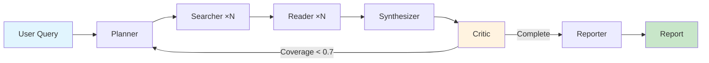
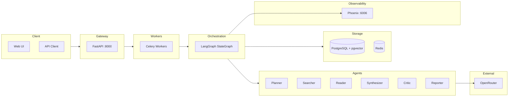
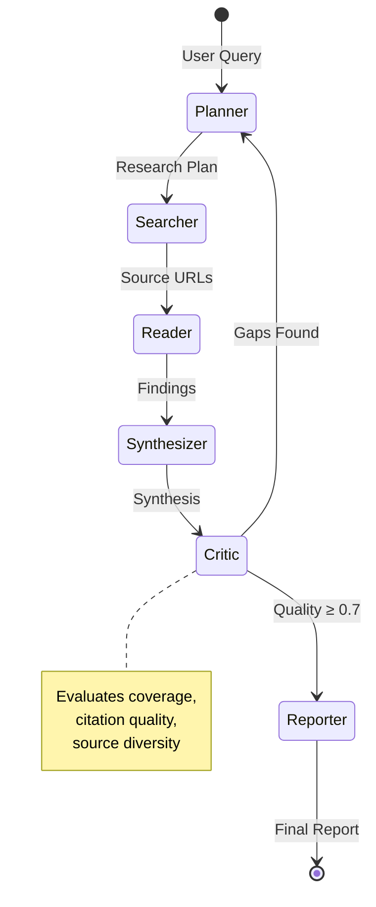
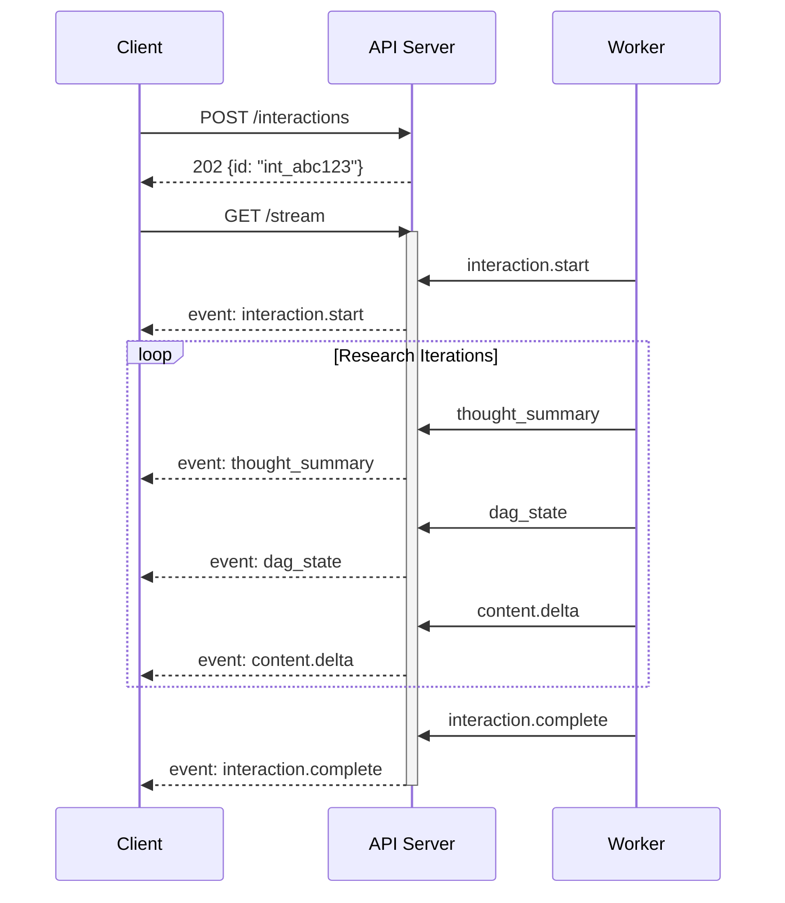
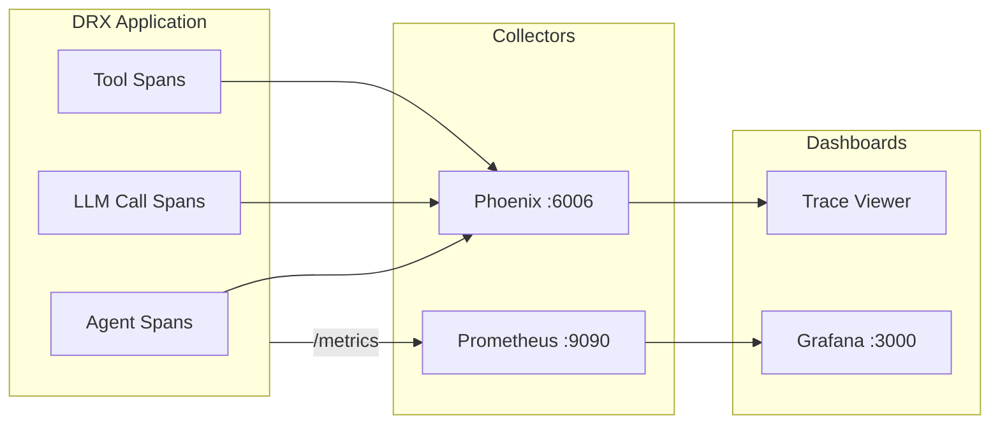
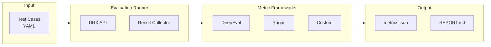
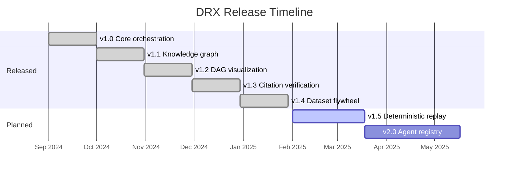

# DRX

**Self-hosted multi-agent research orchestration with full observability and checkpoint/resume.**

[](https://www.python.org/downloads/)
[](https://opensource.org/licenses/MIT)
[](https://github.com/langchain-ai/langgraph)

---

## Overview

DRX orchestrates six specialized AI agents in a directed acyclic graph (DAG) to perform deep research tasks. Unlike consumer research products, DRX provides:

- **Full control**: Self-hosted on your infrastructure with data sovereignty
- **Transparency**: Every agent decision is traced and auditable via Phoenix
- **Resilience**: Checkpoint any research task and resume from failure
- **Extensibility**: Swap models via OpenRouter, add custom tools, modify agents



---

## Quick Launch

**Prerequisites**: Docker, [OpenRouter API key](https://openrouter.ai/keys)

```bash
# 1. Clone and configure
git clone https://github.com/your-org/drx.git && cd drx/v1
cp .env.example deployment/.env
# Edit deployment/.env and set OPENROUTER_API_KEY=sk-or-v1-your-key

# 2. Launch (pulls images, initializes DB, starts 5 services)
cd deployment && docker compose up -d

# 3. Verify
curl -s http://localhost:8000/api/v1/health | jq .status
# → "healthy"
```

See [`.env.example`](.env.example) for all configuration options.

**Access Points**:
| Service | URL | Purpose |
|---------|-----|---------|
| API | http://localhost:8000 | REST + SSE endpoints |
| UI | http://localhost:8000 | Research interface |
| Phoenix | http://localhost:6006 | LLM trace viewer |

---

## Architecture



### Components

| Component | Technology | Role |
|-----------|------------|------|
| **Orchestrator** | LangGraph StateGraph | DAG execution with cycles, checkpointing |
| **Agents** | Python + OpenRouter | Specialized tasks (plan, search, read, synthesize, critique, report) |
| **State** | PostgreSQL + pgvector | Checkpoints, sessions, vector embeddings |
| **Queue** | Redis + Celery | Async job execution with progress streaming |
| **Observability** | Phoenix + OpenTelemetry | Full LLM tracing with token/latency analysis |

**Deep Dive**: [Architecture Guide](docs/ARCHITECTURE.md) · [Low-Level Design](docs/LLD.md)

---

## Agents

| Agent | Input | Output | Tools |
|-------|-------|--------|-------|
| **Planner** | User query | DAG of subtasks with dependencies | — |
| **Searcher** | Search queries | Source URLs with snippets | OpenRouter `:online`, Tavily, RAG |
| **Reader** | URLs | Structured findings (claims, entities, evidence) | PDF extractor, HTML parser |
| **Synthesizer** | Findings | Merged analysis with conflict resolution | Knowledge graph builder |
| **Critic** | Synthesis | Quality score + identified gaps | Citation verifier, bias detector |
| **Reporter** | Final synthesis | Formatted report with citations | HTML/PDF exporter |

### Agent Workflow



### State Schema

```python
class AgentState(TypedDict):
    query: str                    # Original user query
    plan: ResearchPlan            # DAG of subtasks
    findings: list[Finding]       # Extracted information
    synthesis: str                # Merged analysis
    knowledge_graph: KnowledgeGraph
    gaps: list[Gap]               # Identified gaps
    quality_metrics: QualityMetrics
    iteration: int                # Current iteration (max: 5)
```

---

## Usage

### API

```bash
# Start research (returns immediately with interaction_id)
curl -X POST http://localhost:8000/api/v1/interactions \
  -H "Content-Type: application/json" \
  -d '{"input": "Compare vector databases for production AI: Pinecone vs Weaviate vs Milvus"}'

# Response: {"id": "int_abc123", "status": "queued"}

# Stream progress (SSE)
curl -N http://localhost:8000/api/v1/interactions/int_abc123/stream

# Get final result
curl http://localhost:8000/api/v1/interactions/int_abc123
```

### Steerability

Control research output format and constraints:

```json
{
  "input": "Analyze GDPR compliance for AI systems",
  "steerability": {
    "tone": "executive",
    "format": "markdown",
    "max_sources": 15,
    "focus_areas": ["data processing", "consent"],
    "exclude_topics": ["marketing"],
    "preferred_domains": ["*.gov", "*.eu"]
  }
}
```

### SSE Event Flow



**Event Types:**
| Event | Payload | Description |
|-------|---------|-------------|
| `interaction.start` | `{id}` | Research task started |
| `thought_summary` | `{text}` | Agent reasoning step |
| `dag_state` | `{nodes, edges}` | Current DAG state |
| `content.delta` | `{text}` | Incremental report content |
| `interaction.complete` | `{status, duration_seconds}` | Task finished |

### Python

```python
import httpx
import json

# Create research task
response = httpx.post(
    "http://localhost:8000/api/v1/interactions",
    json={"input": "What are the key risks of deploying LLMs in production?"}
)
interaction_id = response.json()["id"]

# Stream results
with httpx.stream("GET", f"http://localhost:8000/api/v1/interactions/{interaction_id}/stream") as r:
    for line in r.iter_lines():
        if line.startswith("data:"):
            event = json.loads(line[5:])
            print(event)
```

---

## Feature Matrix

### Core Features (Implemented)

| Feature | Status | Description |
|---------|--------|-------------|
| Multi-agent DAG orchestration | Production | 6 agents with parallel fan-out/fan-in |
| Checkpoint/Resume | Production | PostgreSQL-backed state persistence |
| SSE progress streaming | Production | Real-time events with reconnection support |
| Knowledge graph | Production | Entity-Relation-Claim with Cytoscape.js export |
| Citation verification | Production | URL accessibility + fuzzy quote matching |
| Phoenix tracing | Production | Full LLM observability with OpenTelemetry |
| Steerability config | Production | Tone, format, domains, focus areas |
| Multi-format export | Production | Markdown, HTML, PDF, JSON |
| Bias detection | Production | Source diversity analysis |
| Coverage scoring | Production | Quality metrics for iteration decisions |

### Partial Implementation

| Feature | Status | Gap |
|---------|--------|-----|
| Tiered model selection | Partial | Routing logic pending |
| Deterministic replay | Partial | Replay endpoint pending |
| NeMo Guardrails | Partial | Integration pending |
| Interactive DAG editing | Partial | PATCH endpoint pending |
| Benchmark runners | Partial | HLE/BrowseComp integration pending |

### Planned (v2.0)

| Feature | Description |
|---------|-------------|
| Agent Registry | Capability-based dynamic routing |
| Metadata Firewall | Policy enforcement middleware |
| Circuit Breaking | Automatic failover on agent degradation |
| RLHF Export | Training data pipeline from traces |
| Human-in-the-Loop | Pause for confirmation at decision points |

---

## Configuration

### Required

```bash
OPENROUTER_API_KEY=sk-or-v1-...  # Required: LLM access
```

### Models

```bash
DEFAULT_MODEL=google/gemini-3-flash-preview        # Fast general tasks
REASONING_MODEL=deepseek/deepseek-r1               # Complex reasoning
SEARCH_MODEL=google/gemini-3-flash-preview:online  # Grounded web search
```

### Budget Controls

```bash
TOKEN_BUDGET_PER_SESSION=500000   # Max tokens per research task
COST_BUDGET_PER_SESSION=1.00      # Max cost in USD
MAX_RESEARCH_ITERATIONS=5         # Max critique cycles
MIN_COVERAGE_SCORE=0.7            # Completion threshold
```

### Full Reference

See [`.env.example`](.env.example) for all configuration options.

---

## Observability



### Phoenix (LLM Tracing)

Access at http://localhost:6006 to view:
- Full prompt/completion traces per agent
- Token usage breakdown by model
- Latency distribution across agents
- Error analysis with stack traces

### Prometheus Metrics

```bash
curl http://localhost:8000/metrics
```

| Metric | Labels | Description |
|--------|--------|-------------|
| `drx_tokens_total` | agent, model, direction | Token consumption |
| `drx_agent_latency_seconds` | agent | Agent execution time |
| `drx_sessions_active` | — | Concurrent research tasks |
| `drx_tool_calls_total` | tool, status | Tool invocation count |

---

## Evaluation

DRX uses [DeepEval](https://github.com/confident-ai/deepeval) and [Ragas](https://github.com/explodinggradients/ragas) for quality assessment.



### Metrics

| Metric | Framework | Threshold | Type |
|--------|-----------|-----------|------|
| task_completion | Custom | >= 0.7 | Hard gate |
| faithfulness | DeepEval | >= 0.8 | Hard gate |
| hallucination | DeepEval | <= 0.2 | Hard gate |
| policy_violations | Custom | 0 | Hard gate |
| answer_relevancy | DeepEval | >= 0.7 | Soft gate |
| context_precision | Ragas | >= 0.6 | Soft gate |

### Run Evaluations

```bash
# Smoke test (2 scenarios)
python ci/evaluation/run_evaluation.py --group smoke_test --verbose

# Full evaluation (10 scenarios)
python ci/evaluation/run_evaluation.py --group full_evaluation --verbose

# Generate report
python ci/evaluation/generate_report.py --output ci/evaluation/EVALUATION_REPORT.md
```

---

## Development

```bash
# Setup
python3.11 -m venv .venv && source .venv/bin/activate
pip install -e ".[dev,eval]"

# Infrastructure only
cd deployment && docker compose up -d postgres redis phoenix

# Run API with hot reload
uvicorn src.api.main:app --reload --port 8000

# Tests
pytest tests/ -v
ruff check .
mypy src/
```

---

## Project Structure

```
src/
├── agents/          # Planner, Searcher, Reader, Synthesizer, Critic, Reporter
├── orchestrator/    # LangGraph workflow, state, checkpointer
├── api/             # FastAPI routes, SSE streaming
├── tools/           # Search, RAG, PDF extraction, citation verification
├── services/        # OpenRouter client, vector store, report exporter
├── observability/   # Phoenix setup, Prometheus metrics
└── models/          # Knowledge graph types

ci/evaluation/       # DeepEval/Ragas test suite
deployment/          # Docker Compose, Dockerfiles
docs/                # ARCHITECTURE.md, LLD.md
```

---

## Roadmap



| Version | Status | Focus |
|---------|--------|-------|
| v1.0 | Released | Core multi-agent orchestration |
| v1.1 | Released | Knowledge graph + parallel execution |
| v1.2 | Released | DAG visualization + argument graph UI |
| v1.3 | Released | PDF extraction + citation verification |
| v1.4 | Released | Dataset flywheel + feedback collection |
| v1.5 | Planned | Deterministic replay + benchmark integration |
| v2.0 | Planned | Agent registry + capability-based routing |

---

## Documentation

### Design Documents

| Document | Description |
|----------|-------------|
| [Architecture Guide](docs/ARCHITECTURE.md) | System design, data flow, component diagrams, observability stack |
| [Low-Level Design](docs/LLD.md) | Class diagrams, API specs, database schema, evaluation framework classes |

### References

| Document | Description |
|----------|-------------|
| [`.env.example`](.env.example) | All configuration options with defaults |
| [Evaluation Report](ci/evaluation/EVALUATION_REPORT.md) | Latest evaluation results and metrics |
| [Gap Analysis](GAP_ANALYSIS_REPORT.md) | DRX.md specification coverage analysis |
| [DRX Specification](../DRX.md) | Original architectural specification |

---

## License

MIT — See [LICENSE](LICENSE)
