# DRX System Architecture

## Table of Contents

1. [High-Level Architecture](#high-level-architecture)
2. [Agentic Workflow](#agentic-workflow)
3. [Parallel Execution Engine](#parallel-execution-engine)
4. [Knowledge Graph System](#knowledge-graph-system)
5. [Tool Layer Architecture](#tool-layer-architecture)
6. [Data Layer](#data-layer)
7. [API Gateway](#api-gateway)
8. [Worker Architecture](#worker-architecture)
9. [Observability Stack](#observability-stack)
10. [Dataset Flywheel](#dataset-flywheel)
11. [Frontend Architecture](#frontend-architecture)

---

## High-Level Architecture

### System Overview

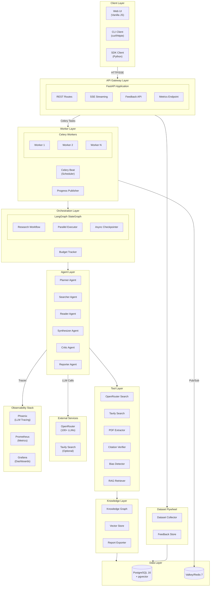
```mermaid
flowchart TB
    subgraph ClientLayer["Client Layer"]
        WebUI["Web UI<br/>(Vanilla JS)"]
        CLI["CLI Client<br/>(curl/httpie)"]
        SDK["SDK Client<br/>(Python)"]
    end

    subgraph APIGateway["API Gateway Layer"]
        subgraph FastAPI["FastAPI Application"]
            Routes["REST Routes"]
            SSE["SSE Streaming"]
            Feedback["Feedback API"]
            Metrics["Metrics Endpoint"]
        end
    end

    subgraph WorkerLayer["Worker Layer"]
        subgraph Celery["Celery Workers"]
            Worker1["Worker 1"]
            Worker2["Worker 2"]
            WorkerN["Worker N"]
        end
        Beat["Celery Beat<br/>(Scheduler)"]
        ProgressPub["Progress Publisher"]
    end

    subgraph OrchestrationLayer["Orchestration Layer"]
        subgraph LangGraph["LangGraph StateGraph"]
            Workflow["Research Workflow"]
            ParallelExec["Parallel Executor"]
            Checkpointer["Async Checkpointer"]
        end
        BudgetTracker["Budget Tracker"]
    end

    subgraph AgentLayer["Agent Layer"]
        Planner["Planner Agent"]
        Searcher["Searcher Agent"]
        Reader["Reader Agent"]
        Synthesizer["Synthesizer Agent"]
        Critic["Critic Agent"]
        Reporter["Reporter Agent"]
    end

    subgraph ToolLayer["Tool Layer"]
        OpenRouterSearch["OpenRouter Search"]
        TavilySearch["Tavily Search"]
        PDFExtract["PDF Extractor"]
        CitationVerify["Citation Verifier"]
        BiasDetect["Bias Detector"]
        RAGRetriever["RAG Retriever"]
    end

    subgraph KnowledgeLayer["Knowledge Layer"]
        KGraph["Knowledge Graph"]
        VectorStore["Vector Store"]
        ReportExport["Report Exporter"]
    end

    subgraph DataLayer["Data Layer"]
        Postgres[("PostgreSQL 16<br/>+ pgvector")]
        Redis[("Valkey/Redis 7")]
    end

    subgraph ExternalServices["External Services"]
        OpenRouter["OpenRouter<br/>(100+ LLMs)"]
        Tavily["Tavily Search<br/>(Optional)"]
    end

    subgraph ObservabilityStack["Observability Stack"]
        Phoenix["Phoenix<br/>(LLM Tracing)"]
        Prometheus["Prometheus<br/>(Metrics)"]
        Grafana["Grafana<br/>(Dashboards)"]
    end

    subgraph FlywheelSystem["Dataset Flywheel"]
        Collector["Dataset Collector"]
        FeedbackStore["Feedback Store"]
    end

    ClientLayer -->|"HTTP/SSE"| APIGateway
    APIGateway -->|"Celery Tasks"| WorkerLayer
    WorkerLayer --> OrchestrationLayer
    OrchestrationLayer --> AgentLayer
    AgentLayer --> ToolLayer
    ToolLayer --> KnowledgeLayer
    KnowledgeLayer --> DataLayer
    AgentLayer -->|"LLM Calls"| ExternalServices
    AgentLayer -->|"Traces"| ObservabilityStack
    APIGateway --> FlywheelSystem
    FlywheelSystem --> DataLayer
    WorkerLayer -->|"Pub/Sub"| Redis
```

### Component Summary

| Layer | Components | Technology |
|-------|------------|------------|
| **Client** | Web UI, CLI, SDK | Vanilla JS, D3.js, Cytoscape.js |
| **API Gateway** | FastAPI, Middleware Stack | FastAPI 0.115+, Pydantic |
| **Worker** | Celery Workers, Beat Scheduler | Celery 5.4+, Redis |
| **Orchestration** | LangGraph StateGraph, Parallel Executor | LangGraph 1.0+ |
| **Agent** | 6 Specialized Agents | BaseAgent framework |
| **Tool** | Search, PDF, Citation, Bias, RAG | Custom tools |
| **Knowledge** | Knowledge Graph, Vector Store, Exporter | TypedDict, pgvector, Jinja2 |
| **Data** | PostgreSQL, Redis | PostgreSQL 16+, Valkey 7+ |
| **External** | LLM, Search | OpenRouter, Tavily |
| **Observability** | Tracing, Metrics, Dashboards | Phoenix, Prometheus, Grafana |

---

## Agentic Workflow

### Research DAG (Directed Acyclic Graph)

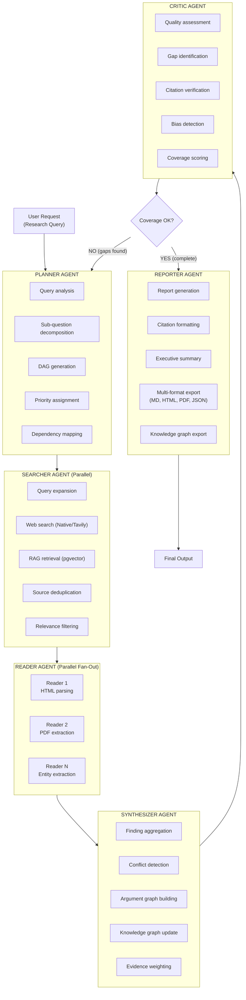
```mermaid
flowchart TB
    UserQuery["User Request<br/>(Research Query)"]

    subgraph PlannerBox["PLANNER AGENT"]
        P1["Query analysis"]
        P2["Sub-question decomposition"]
        P3["DAG generation"]
        P4["Priority assignment"]
        P5["Dependency mapping"]
    end

    subgraph SearcherBox["SEARCHER AGENT (Parallel)"]
        S1["Query expansion"]
        S2["Web search (Native/Tavily)"]
        S3["RAG retrieval (pgvector)"]
        S4["Source deduplication"]
        S5["Relevance filtering"]
    end

    subgraph ReaderFanOut["READER AGENT (Parallel Fan-Out)"]
        Reader1["Reader 1<br/>HTML parsing"]
        Reader2["Reader 2<br/>PDF extraction"]
        ReaderN["Reader N<br/>Entity extraction"]
    end

    subgraph SynthesizerBox["SYNTHESIZER AGENT"]
        SY1["Finding aggregation"]
        SY2["Conflict detection"]
        SY3["Argument graph building"]
        SY4["Knowledge graph update"]
        SY5["Evidence weighting"]
    end

    subgraph CriticBox["CRITIC AGENT"]
        C1["Quality assessment"]
        C2["Gap identification"]
        C3["Citation verification"]
        C4["Bias detection"]
        C5["Coverage scoring"]
    end

    CoverageCheck{"Coverage OK?"}

    subgraph ReporterBox["REPORTER AGENT"]
        R1["Report generation"]
        R2["Citation formatting"]
        R3["Executive summary"]
        R4["Multi-format export<br/>(MD, HTML, PDF, JSON)"]
        R5["Knowledge graph export"]
    end

    FinalOutput["Final Output"]

    UserQuery --> PlannerBox
    PlannerBox --> SearcherBox
    SearcherBox --> ReaderFanOut
    ReaderFanOut --> SynthesizerBox
    SynthesizerBox --> CriticBox
    CriticBox --> CoverageCheck

    CoverageCheck -->|"YES (complete)"| ReporterBox
    CoverageCheck -->|"NO (gaps found)"| PlannerBox

    ReporterBox --> FinalOutput
```

### Agent State Flow

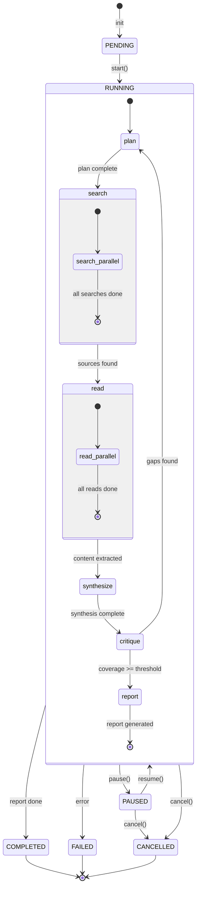
```mermaid
stateDiagram-v2
    [*] --> PENDING: init

    PENDING --> RUNNING: start()

    state RUNNING {
        [*] --> plan
        plan --> search: plan complete

        state search {
            [*] --> search_parallel
            search_parallel --> [*]: all searches done
        }

        search --> read: sources found

        state read {
            [*] --> read_parallel
            read_parallel --> [*]: all reads done
        }

        read --> synthesize: content extracted
        synthesize --> critique: synthesis complete

        critique --> report: coverage >= threshold
        critique --> plan: gaps found

        report --> [*]: report generated
    }

    RUNNING --> COMPLETED: report done
    RUNNING --> FAILED: error
    RUNNING --> PAUSED: pause()
    RUNNING --> CANCELLED: cancel()

    PAUSED --> RUNNING: resume()
    PAUSED --> CANCELLED: cancel()

    COMPLETED --> [*]
    FAILED --> [*]
    CANCELLED --> [*]
```

### Agent Communication via Shared State

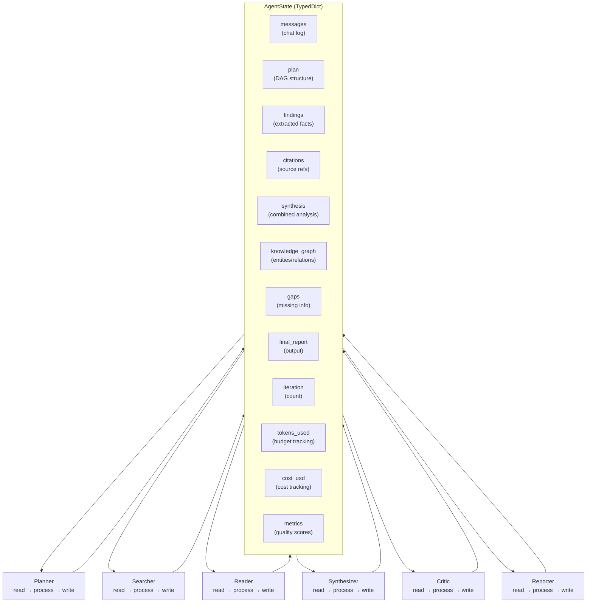
```mermaid
flowchart TB
    subgraph SharedState["AgentState (TypedDict)"]
        direction LR
        messages["messages<br/>(chat log)"]
        plan["plan<br/>(DAG structure)"]
        findings["findings<br/>(extracted facts)"]
        citations["citations<br/>(source refs)"]
        synthesis["synthesis<br/>(combined analysis)"]
        knowledge_graph["knowledge_graph<br/>(entities/relations)"]
        gaps["gaps<br/>(missing info)"]
        final_report["final_report<br/>(output)"]
        iteration["iteration<br/>(count)"]
        tokens_used["tokens_used<br/>(budget tracking)"]
        cost_usd["cost_usd<br/>(cost tracking)"]
        metrics["metrics<br/>(quality scores)"]
    end

    Agent1["Planner<br/>read → process → write"]
    Agent2["Searcher<br/>read → process → write"]
    Agent3["Reader<br/>read → process → write"]
    Agent4["Synthesizer<br/>read → process → write"]
    Agent5["Critic<br/>read → process → write"]
    Agent6["Reporter<br/>read → process → write"]

    SharedState --> Agent1
    SharedState --> Agent2
    SharedState --> Agent3
    SharedState --> Agent4
    SharedState --> Agent5
    SharedState --> Agent6

    Agent1 --> SharedState
    Agent2 --> SharedState
    Agent3 --> SharedState
    Agent4 --> SharedState
    Agent5 --> SharedState
    Agent6 --> SharedState
```

---

## Parallel Execution Engine

### Fan-Out / Fan-In Pattern

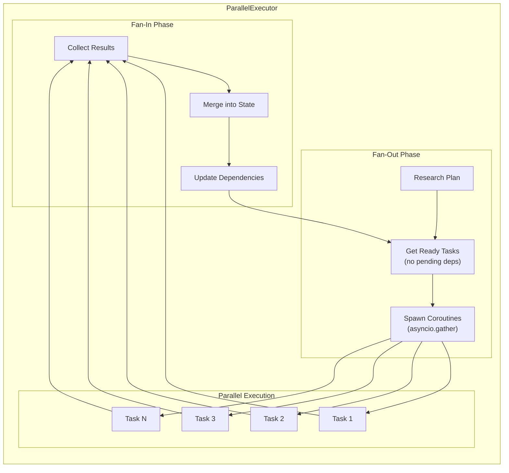
```mermaid
flowchart TB
    subgraph ParallelExecutor["ParallelExecutor"]
        direction TB

        subgraph FanOut["Fan-Out Phase"]
            Plan["Research Plan"]
            Ready["Get Ready Tasks<br/>(no pending deps)"]
            Spawn["Spawn Coroutines<br/>(asyncio.gather)"]
        end

        subgraph Execution["Parallel Execution"]
            Task1["Task 1"]
            Task2["Task 2"]
            Task3["Task 3"]
            TaskN["Task N"]
        end

        subgraph FanIn["Fan-In Phase"]
            Collect["Collect Results"]
            Merge["Merge into State"]
            Update["Update Dependencies"]
        end

        Plan --> Ready
        Ready --> Spawn
        Spawn --> Task1 & Task2 & Task3 & TaskN
        Task1 & Task2 & Task3 & TaskN --> Collect
        Collect --> Merge
        Merge --> Update
        Update --> Ready
    end
```

### Dependency Resolution (Kahn's Algorithm)

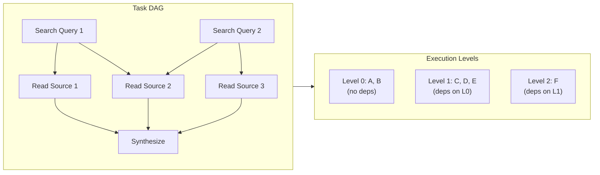
```mermaid
flowchart LR
    subgraph DAG["Task DAG"]
        A["Search Query 1"]
        B["Search Query 2"]
        C["Read Source 1"]
        D["Read Source 2"]
        E["Read Source 3"]
        F["Synthesize"]

        A --> C
        A --> D
        B --> D
        B --> E
        C --> F
        D --> F
        E --> F
    end

    subgraph Levels["Execution Levels"]
        L0["Level 0: A, B<br/>(no deps)"]
        L1["Level 1: C, D, E<br/>(deps on L0)"]
        L2["Level 2: F<br/>(deps on L1)"]
    end

    DAG --> Levels
```

### Parallel Execution Sequence

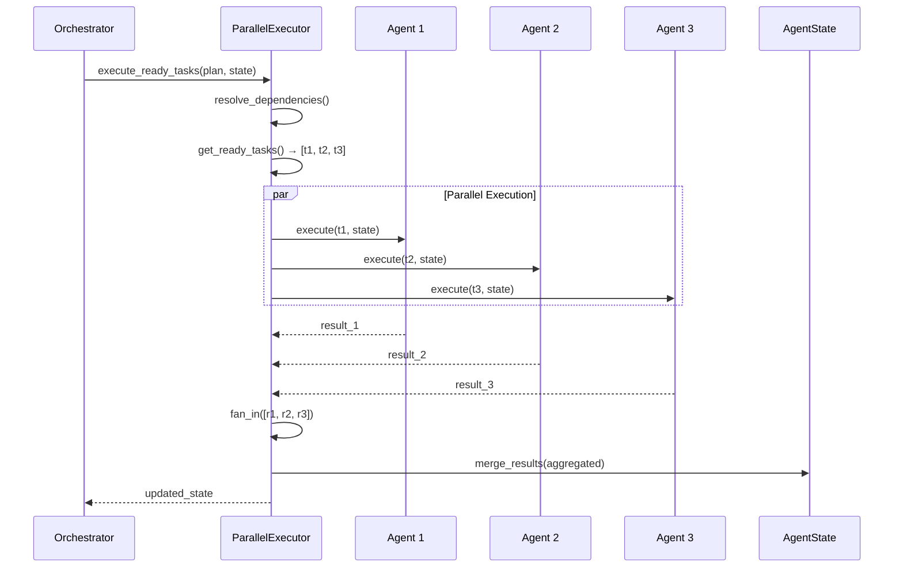
```mermaid
sequenceDiagram
    participant O as Orchestrator
    participant PE as ParallelExecutor
    participant A1 as Agent 1
    participant A2 as Agent 2
    participant A3 as Agent 3
    participant State as AgentState

    O->>PE: execute_ready_tasks(plan, state)
    PE->>PE: resolve_dependencies()
    PE->>PE: get_ready_tasks() → [t1, t2, t3]

    par Parallel Execution
        PE->>A1: execute(t1, state)
        PE->>A2: execute(t2, state)
        PE->>A3: execute(t3, state)
    end

    A1-->>PE: result_1
    A2-->>PE: result_2
    A3-->>PE: result_3

    PE->>PE: fan_in([r1, r2, r3])
    PE->>State: merge_results(aggregated)
    PE-->>O: updated_state
```

---

## Knowledge Graph System

### Entity-Relation-Claim Model

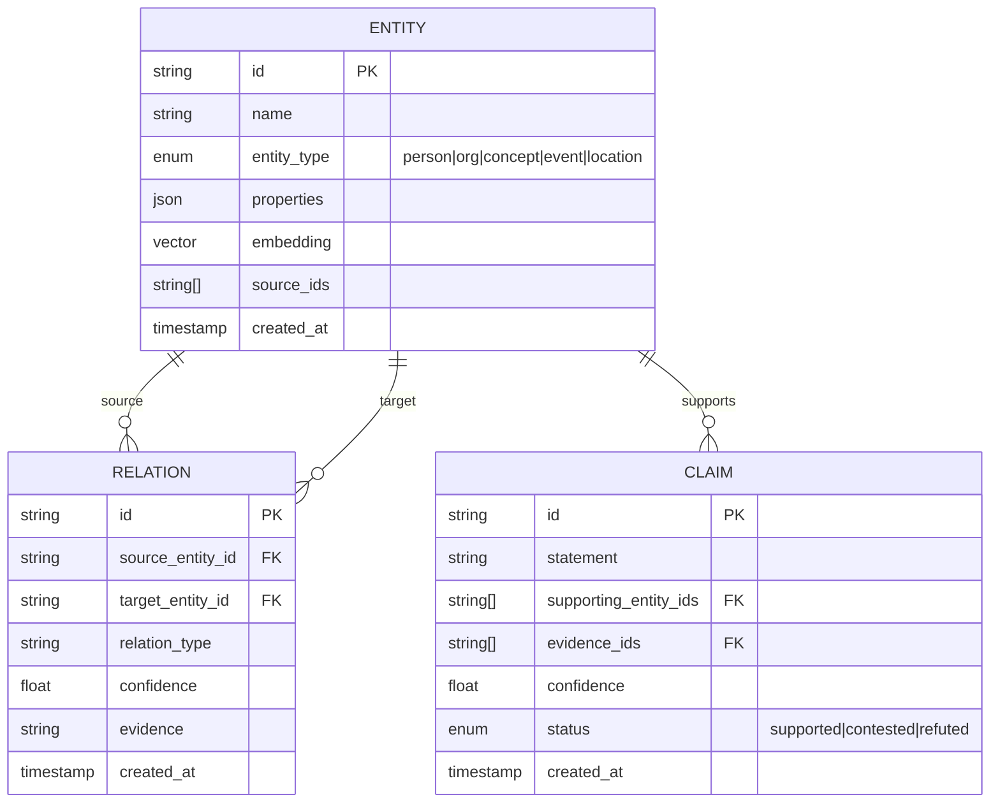
```mermaid
erDiagram
    ENTITY {
        string id PK
        string name
        enum entity_type "person|org|concept|event|location"
        json properties
        vector embedding
        string[] source_ids
        timestamp created_at
    }

    RELATION {
        string id PK
        string source_entity_id FK
        string target_entity_id FK
        string relation_type
        float confidence
        string evidence
        timestamp created_at
    }

    CLAIM {
        string id PK
        string statement
        string[] supporting_entity_ids FK
        string[] evidence_ids FK
        float confidence
        enum status "supported|contested|refuted"
        timestamp created_at
    }

    ENTITY ||--o{ RELATION : "source"
    ENTITY ||--o{ RELATION : "target"
    ENTITY ||--o{ CLAIM : "supports"
```

### Knowledge Graph Operations

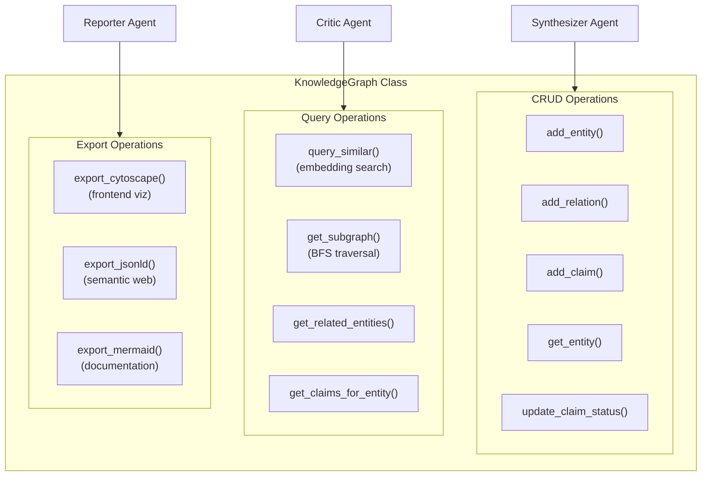
```mermaid
flowchart TB
    subgraph KnowledgeGraph["KnowledgeGraph Class"]
        subgraph CRUD["CRUD Operations"]
            AddEntity["add_entity()"]
            AddRelation["add_relation()"]
            AddClaim["add_claim()"]
            GetEntity["get_entity()"]
            UpdateClaim["update_claim_status()"]
        end

        subgraph Query["Query Operations"]
            QuerySimilar["query_similar()<br/>(embedding search)"]
            GetSubgraph["get_subgraph()<br/>(BFS traversal)"]
            GetRelated["get_related_entities()"]
            GetClaims["get_claims_for_entity()"]
        end

        subgraph Export["Export Operations"]
            Cytoscape["export_cytoscape()<br/>(frontend viz)"]
            JSONLD["export_jsonld()<br/>(semantic web)"]
            Mermaid["export_mermaid()<br/>(documentation)"]
        end
    end

    Synthesizer["Synthesizer Agent"] --> CRUD
    Critic["Critic Agent"] --> Query
    Reporter["Reporter Agent"] --> Export
```

### Cytoscape Export Format

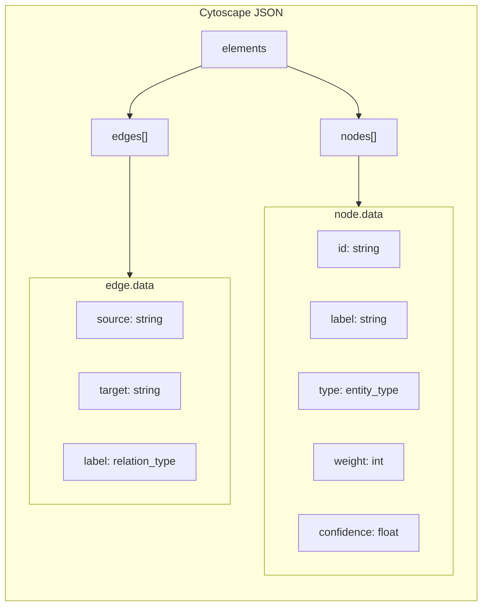
```mermaid
flowchart LR
    subgraph CytoscapeJSON["Cytoscape JSON"]
        Elements["elements"]
        Nodes["nodes[]"]
        Edges["edges[]"]

        subgraph NodeData["node.data"]
            id["id: string"]
            label["label: string"]
            type["type: entity_type"]
            weight["weight: int"]
            confidence["confidence: float"]
        end

        subgraph EdgeData["edge.data"]
            source["source: string"]
            target["target: string"]
            relType["label: relation_type"]
        end

        Elements --> Nodes & Edges
        Nodes --> NodeData
        Edges --> EdgeData
    end
```

---

## Tool Layer Architecture

### Tool Hierarchy

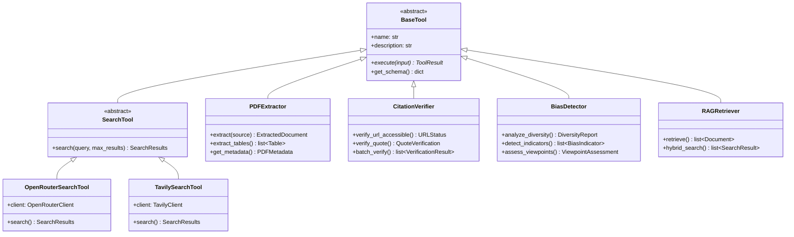
```mermaid
classDiagram
    class BaseTool {
        <<abstract>>
        +name: str
        +description: str
        +execute(input)* ToolResult
        +get_schema() dict
    }

    class SearchTool {
        <<abstract>>
        +search(query, max_results) SearchResults
    }

    class OpenRouterSearchTool {
        +client: OpenRouterClient
        +search() SearchResults
    }

    class TavilySearchTool {
        +client: TavilyClient
        +search() SearchResults
    }

    class PDFExtractor {
        +extract(source) ExtractedDocument
        +extract_tables() list~Table~
        +get_metadata() PDFMetadata
    }

    class CitationVerifier {
        +verify_url_accessible() URLStatus
        +verify_quote() QuoteVerification
        +batch_verify() list~VerificationResult~
    }

    class BiasDetector {
        +analyze_diversity() DiversityReport
        +detect_indicators() list~BiasIndicator~
        +assess_viewpoints() ViewpointAssessment
    }

    class RAGRetriever {
        +retrieve() list~Document~
        +hybrid_search() list~SearchResult~
    }

    BaseTool <|-- SearchTool
    SearchTool <|-- OpenRouterSearchTool
    SearchTool <|-- TavilySearchTool
    BaseTool <|-- PDFExtractor
    BaseTool <|-- CitationVerifier
    BaseTool <|-- BiasDetector
    BaseTool <|-- RAGRetriever
```

### Citation Verification Flow

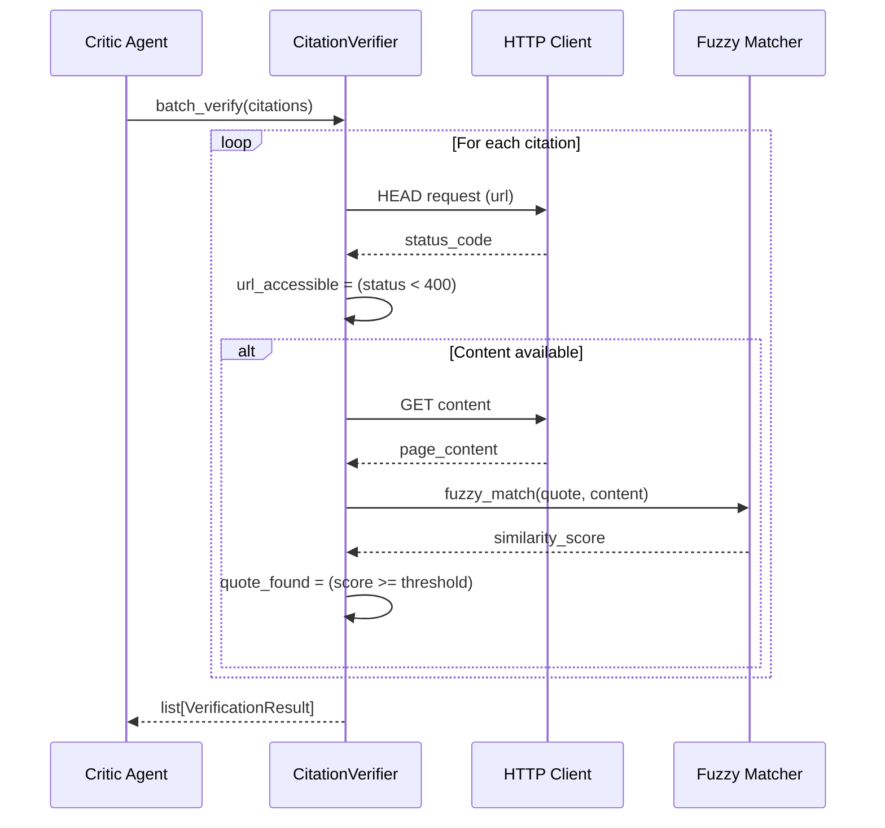
```mermaid
sequenceDiagram
    participant Critic as Critic Agent
    participant CV as CitationVerifier
    participant HTTP as HTTP Client
    participant Fuzzy as Fuzzy Matcher

    Critic->>CV: batch_verify(citations)

    loop For each citation
        CV->>HTTP: HEAD request (url)
        HTTP-->>CV: status_code
        CV->>CV: url_accessible = (status < 400)

        alt Content available
            CV->>HTTP: GET content
            HTTP-->>CV: page_content
            CV->>Fuzzy: fuzzy_match(quote, content)
            Fuzzy-->>CV: similarity_score
            CV->>CV: quote_found = (score >= threshold)
        end
    end

    CV-->>Critic: list[VerificationResult]
```

### Bias Detection Flow

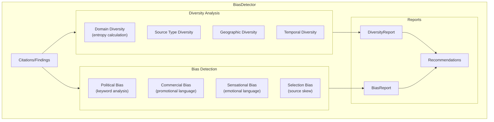
```mermaid
flowchart TB
    subgraph BiasDetector["BiasDetector"]
        Input["Citations/Findings"]

        subgraph DiversityAnalysis["Diversity Analysis"]
            DomainDiv["Domain Diversity<br/>(entropy calculation)"]
            TypeDiv["Source Type Diversity"]
            GeoDiv["Geographic Diversity"]
            TempDiv["Temporal Diversity"]
        end

        subgraph BiasIndicators["Bias Detection"]
            Political["Political Bias<br/>(keyword analysis)"]
            Commercial["Commercial Bias<br/>(promotional language)"]
            Sensational["Sensational Bias<br/>(emotional language)"]
            Selective["Selection Bias<br/>(source skew)"]
        end

        subgraph Output["Reports"]
            DivReport["DiversityReport"]
            BiasReport["BiasReport"]
            Recommendations["Recommendations"]
        end

        Input --> DiversityAnalysis
        Input --> BiasIndicators
        DiversityAnalysis --> DivReport
        BiasIndicators --> BiasReport
        DivReport & BiasReport --> Recommendations
    end
```

---

## Data Layer

### PostgreSQL Schema

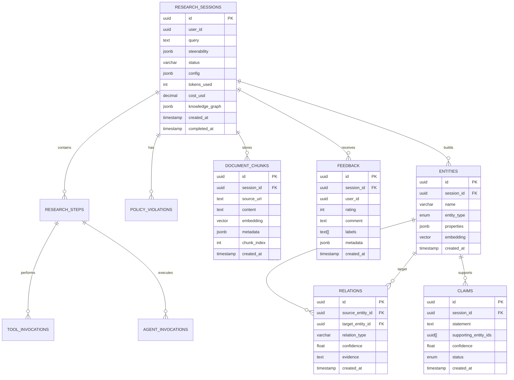
```mermaid
erDiagram
    RESEARCH_SESSIONS ||--o{ RESEARCH_STEPS : contains
    RESEARCH_SESSIONS ||--o{ POLICY_VIOLATIONS : has
    RESEARCH_SESSIONS ||--o{ DOCUMENT_CHUNKS : stores
    RESEARCH_SESSIONS ||--o{ FEEDBACK : receives
    RESEARCH_SESSIONS ||--o{ ENTITIES : builds

    RESEARCH_STEPS ||--o{ TOOL_INVOCATIONS : performs
    RESEARCH_STEPS ||--o{ AGENT_INVOCATIONS : executes

    ENTITIES ||--o{ RELATIONS : source
    ENTITIES ||--o{ RELATIONS : target
    ENTITIES ||--o{ CLAIMS : supports

    RESEARCH_SESSIONS {
        uuid id PK
        uuid user_id
        text query
        jsonb steerability
        varchar status
        jsonb config
        int tokens_used
        decimal cost_usd
        jsonb knowledge_graph
        timestamp created_at
        timestamp completed_at
    }

    FEEDBACK {
        uuid id PK
        uuid session_id FK
        uuid user_id
        int rating
        text comment
        text[] labels
        jsonb metadata
        timestamp created_at
    }

    ENTITIES {
        uuid id PK
        uuid session_id FK
        varchar name
        enum entity_type
        jsonb properties
        vector embedding
        timestamp created_at
    }

    RELATIONS {
        uuid id PK
        uuid source_entity_id FK
        uuid target_entity_id FK
        varchar relation_type
        float confidence
        text evidence
        timestamp created_at
    }

    CLAIMS {
        uuid id PK
        uuid session_id FK
        text statement
        uuid[] supporting_entity_ids
        float confidence
        enum status
        timestamp created_at
    }

    DOCUMENT_CHUNKS {
        uuid id PK
        uuid session_id FK
        text source_url
        text content
        vector embedding
        jsonb metadata
        int chunk_index
        timestamp created_at
    }
```

### Vector Store Architecture

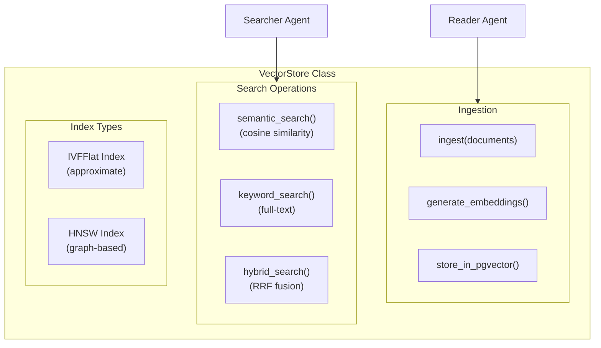
```mermaid
flowchart TB
    subgraph VectorStore["VectorStore Class"]
        subgraph Ingestion["Ingestion"]
            Ingest["ingest(documents)"]
            Embed["generate_embeddings()"]
            Store["store_in_pgvector()"]
        end

        subgraph Search["Search Operations"]
            Semantic["semantic_search()<br/>(cosine similarity)"]
            Keyword["keyword_search()<br/>(full-text)"]
            Hybrid["hybrid_search()<br/>(RRF fusion)"]
        end

        subgraph Index["Index Types"]
            IVFFlat["IVFFlat Index<br/>(approximate)"]
            HNSW["HNSW Index<br/>(graph-based)"]
        end
    end

    Reader["Reader Agent"] --> Ingestion
    Searcher["Searcher Agent"] --> Search
```

### Hybrid Search (RRF Algorithm)

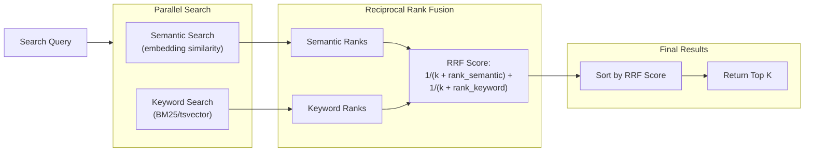
```mermaid
flowchart LR
    Query["Search Query"]

    subgraph Parallel["Parallel Search"]
        Semantic["Semantic Search<br/>(embedding similarity)"]
        Keyword["Keyword Search<br/>(BM25/tsvector)"]
    end

    subgraph RRF["Reciprocal Rank Fusion"]
        Rank1["Semantic Ranks"]
        Rank2["Keyword Ranks"]
        Fusion["RRF Score:<br/>1/(k + rank_semantic) +<br/>1/(k + rank_keyword)"]
    end

    subgraph Results["Final Results"]
        Sorted["Sort by RRF Score"]
        TopK["Return Top K"]
    end

    Query --> Parallel
    Semantic --> Rank1
    Keyword --> Rank2
    Rank1 & Rank2 --> Fusion
    Fusion --> Sorted --> TopK
```

---

## API Gateway

### Route Structure

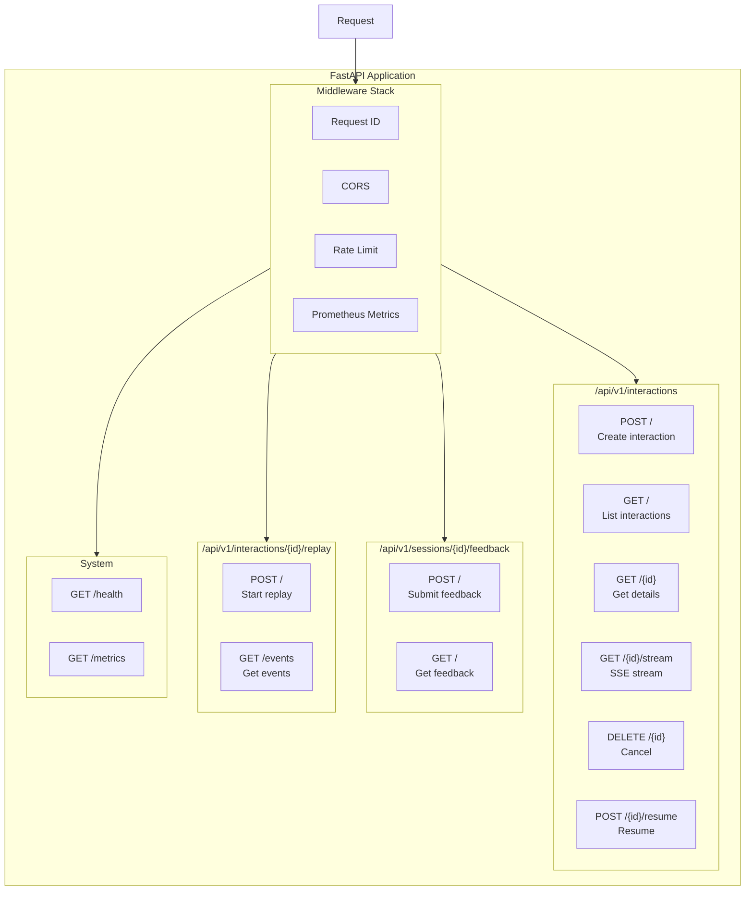
```mermaid
flowchart TB
    subgraph FastAPI["FastAPI Application"]
        subgraph Middleware["Middleware Stack"]
            ReqID["Request ID"]
            CORS["CORS"]
            RateLimit["Rate Limit"]
            Metrics["Prometheus Metrics"]
        end

        subgraph CoreRoutes["/api/v1/interactions"]
            POST_Create["POST /<br/>Create interaction"]
            GET_List["GET /<br/>List interactions"]
            GET_Detail["GET /{id}<br/>Get details"]
            GET_Stream["GET /{id}/stream<br/>SSE stream"]
            DELETE_Cancel["DELETE /{id}<br/>Cancel"]
            POST_Resume["POST /{id}/resume<br/>Resume"]
        end

        subgraph FeedbackRoutes["/api/v1/sessions/{id}/feedback"]
            POST_Feedback["POST /<br/>Submit feedback"]
            GET_Feedback["GET /<br/>Get feedback"]
        end

        subgraph ReplayRoutes["/api/v1/interactions/{id}/replay"]
            POST_Replay["POST /<br/>Start replay"]
            GET_Events["GET /events<br/>Get events"]
        end

        subgraph SystemRoutes["System"]
            Health["GET /health"]
            MetricsEnd["GET /metrics"]
        end
    end

    Request["Request"] --> Middleware
    Middleware --> CoreRoutes & FeedbackRoutes & ReplayRoutes & SystemRoutes
```

### SSE Event Flow

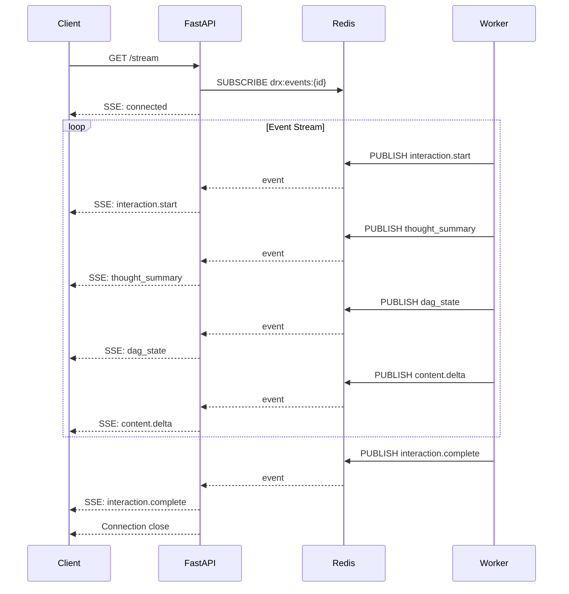
```mermaid
sequenceDiagram
    participant C as Client
    participant API as FastAPI
    participant R as Redis
    participant W as Worker

    C->>API: GET /stream
    API->>R: SUBSCRIBE drx:events:{id}
    API-->>C: SSE: connected

    loop Event Stream
        W->>R: PUBLISH interaction.start
        R-->>API: event
        API-->>C: SSE: interaction.start

        W->>R: PUBLISH thought_summary
        R-->>API: event
        API-->>C: SSE: thought_summary

        W->>R: PUBLISH dag_state
        R-->>API: event
        API-->>C: SSE: dag_state

        W->>R: PUBLISH content.delta
        R-->>API: event
        API-->>C: SSE: content.delta
    end

    W->>R: PUBLISH interaction.complete
    R-->>API: event
    API-->>C: SSE: interaction.complete
    API-->>C: Connection close
```

---

## Worker Architecture

### Celery Worker Structure

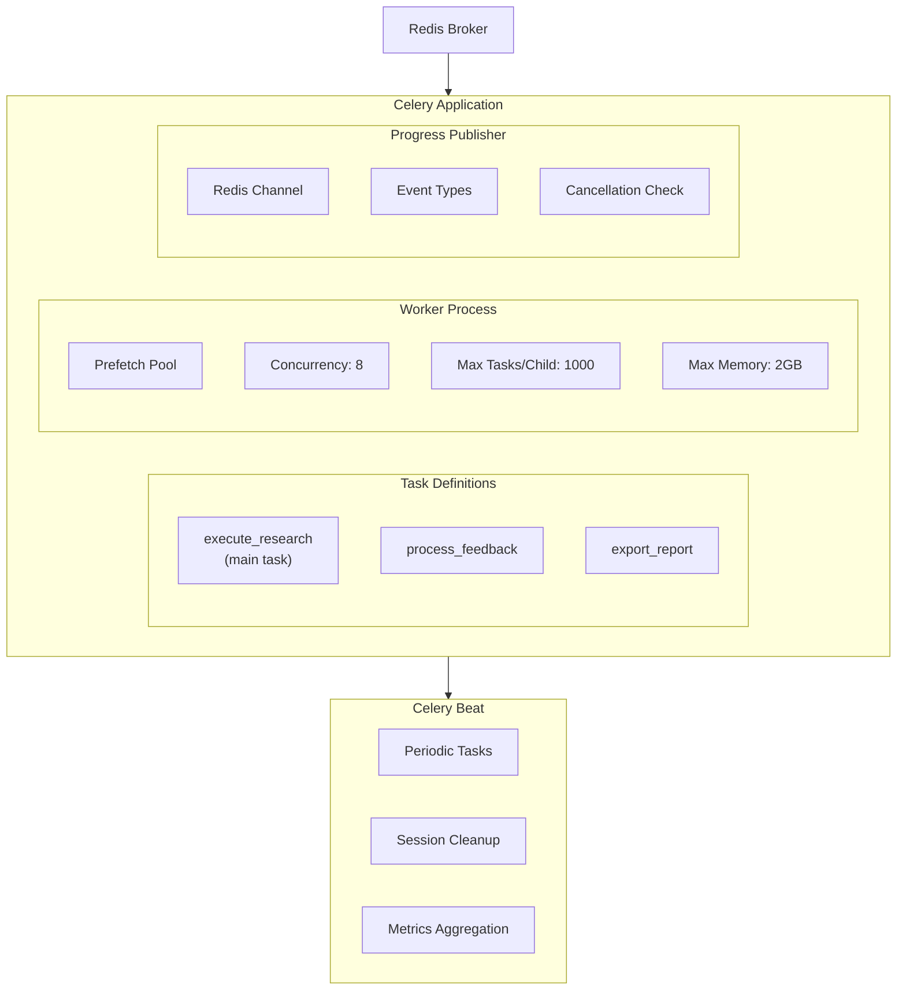
```mermaid
flowchart TB
    subgraph CeleryApp["Celery Application"]
        subgraph Tasks["Task Definitions"]
            ExecuteResearch["execute_research<br/>(main task)"]
            ProcessFeedback["process_feedback"]
            ExportReport["export_report"]
        end

        subgraph Worker["Worker Process"]
            Prefetch["Prefetch Pool"]
            Concurrency["Concurrency: 8"]
            MaxTasks["Max Tasks/Child: 1000"]
            MaxMem["Max Memory: 2GB"]
        end

        subgraph ProgressPub["Progress Publisher"]
            Channel["Redis Channel"]
            Events["Event Types"]
            Cancellation["Cancellation Check"]
        end
    end

    subgraph Beat["Celery Beat"]
        Schedule["Periodic Tasks"]
        Cleanup["Session Cleanup"]
        Metrics["Metrics Aggregation"]
    end

    Redis["Redis Broker"] --> CeleryApp
    CeleryApp --> Beat
```

### Worker Execution Flow

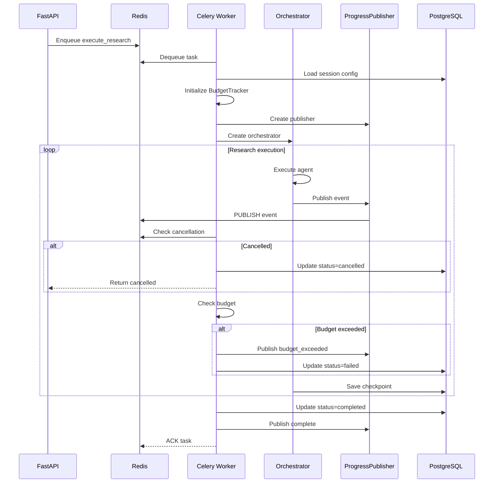
```mermaid
sequenceDiagram
    participant API as FastAPI
    participant Redis as Redis
    participant Worker as Celery Worker
    participant Orch as Orchestrator
    participant Progress as ProgressPublisher
    participant DB as PostgreSQL

    API->>Redis: Enqueue execute_research
    Worker->>Redis: Dequeue task

    Worker->>DB: Load session config
    Worker->>Worker: Initialize BudgetTracker
    Worker->>Progress: Create publisher

    Worker->>Orch: Create orchestrator

    loop Research execution
        Orch->>Orch: Execute agent
        Orch->>Progress: Publish event
        Progress->>Redis: PUBLISH event

        Worker->>Redis: Check cancellation
        alt Cancelled
            Worker->>DB: Update status=cancelled
            Worker-->>API: Return cancelled
        end

        Worker->>Worker: Check budget
        alt Budget exceeded
            Worker->>Progress: Publish budget_exceeded
            Worker->>DB: Update status=failed
        end

        Orch->>DB: Save checkpoint
    end

    Worker->>DB: Update status=completed
    Worker->>Progress: Publish complete
    Worker-->>Redis: ACK task
```

---

## Observability Stack

### Tracing Architecture

```mermaid
flowchart TB
    subgraph Application["Application"]
        RootSpan["Root Span<br/>research_session"]

        subgraph AgentSpans["Agent Spans"]
            PlannerSpan["planner_agent"]
            SearcherSpan["searcher_agent"]
            ReaderSpan["reader_agent"]
            SynthesizerSpan["synthesizer_agent"]
            CriticSpan["critic_agent"]
            ReporterSpan["reporter_agent"]
        end

        subgraph ToolSpans["Tool Spans"]
            LLMSpan["llm_call"]
            SearchSpan["web_search"]
            RAGSpan["rag_retrieve"]
        end
    end

    subgraph Phoenix["Phoenix Collector"]
        OTLP["OTLP Receiver<br/>:4317"]
        Storage["Trace Storage"]
        UI["Web UI<br/>:6006"]
    end

    RootSpan --> AgentSpans
    AgentSpans --> ToolSpans
    ToolSpans -->|"OTLP/gRPC"| Phoenix
```

### Prometheus Metrics

```mermaid
flowchart TB
    subgraph Metrics["Prometheus Metrics"]
        subgraph Counters["Counters"]
            TokensTotal["drx_tokens_total<br/>{model, agent, direction}"]
            AgentExec["drx_agent_executions_total<br/>{agent, status}"]
            SearchQueries["drx_search_queries_total<br/>{engine, status}"]
        end

        subgraph Histograms["Histograms"]
            RequestLatency["drx_request_latency_seconds<br/>{endpoint, method}"]
            AgentLatency["drx_agent_latency_seconds<br/>{agent}"]
            LLMLatency["drx_llm_latency_seconds<br/>{model}"]
        end

        subgraph Gauges["Gauges"]
            ActiveSessions["drx_sessions_active"]
            BudgetRemaining["drx_budget_remaining_tokens"]
            CircuitState["drx_circuit_breaker_state<br/>{agent}"]
        end
    end

    subgraph Collection["Collection"]
        Middleware["Metrics Middleware"]
        Decorator["@agent_metrics"]
        Manual["Manual Recording"]
    end

    subgraph Export["Export"]
        Endpoint["/metrics"]
        Prometheus["Prometheus Scrape"]
        Grafana["Grafana Dashboards"]
    end

    Collection --> Metrics
    Metrics --> Export
```

### Grafana Dashboards

```mermaid
flowchart LR
    subgraph Dashboards["Grafana Dashboards"]
        subgraph Overview["DRX Overview"]
            SessionRate["Session Rate"]
            SuccessRate["Success Rate"]
            AvgLatency["Avg Latency"]
            TokenUsage["Token Usage"]
        end

        subgraph Agents["DRX Agents"]
            AgentLatencies["Agent Latencies"]
            ErrorRates["Error Rates"]
            CircuitStates["Circuit States"]
            TokensByAgent["Tokens by Agent"]
        end
    end

    Prometheus["Prometheus<br/>Data Source"] --> Dashboards
```

---

## Dataset Flywheel

### Continuous Learning Pipeline

```mermaid
flowchart TB
    subgraph Collection["Data Collection"]
        Session["Research Session"]
        Feedback["User Feedback<br/>(rating, labels)"]
        Quality["Quality Metrics"]
        Bias["Bias Report"]
    end

    subgraph Storage["Storage Layer"]
        Collector["DatasetCollector"]
        FeedbackStore["FeedbackStore"]
        QualityTiers["Quality Tiers<br/>(gold/silver/bronze)"]
    end

    subgraph Export["Export Formats"]
        JSONL["JSONL"]
        HuggingFace["HuggingFace Datasets"]
        OpenAI["OpenAI Fine-tune"]
    end

    subgraph Training["Training Pipeline"]
        Filter["Filter by Rating"]
        Format["Format for Training"]
        FineTune["Fine-tune Model"]
    end

    Collection --> Storage
    Storage --> Export
    Export --> Training
    Training -->|"Improved Model"| Session
```

### Feedback Collection Flow

```mermaid
sequenceDiagram
    participant U as User
    participant API as FastAPI
    participant FS as FeedbackStore
    participant DC as DatasetCollector
    participant Redis as Redis
    participant DB as PostgreSQL

    U->>API: POST /feedback {rating, labels}
    API->>API: Validate session exists
    API->>FS: submit_feedback()

    FS->>DB: INSERT feedback record
    FS->>Redis: Cache feedback
    FS->>Redis: Update aggregate metrics

    FS->>DC: record_session_feedback()
    DC->>DC: Classify quality tier
    DC->>DC: Update training dataset

    API-->>U: 201 Created {feedback_id}
```

### Quality Tier Classification

```mermaid
flowchart TB
    Session["Completed Session"]

    Feedback{"Has Feedback?"}

    Rating{"Rating?"}

    Gold["GOLD Tier<br/>(rating >= 4)"]
    Silver["SILVER Tier<br/>(rating 3-4)"]
    Bronze["BRONZE Tier<br/>(rating < 3)"]
    Unrated["UNRATED Tier"]

    Session --> Feedback
    Feedback -->|"Yes"| Rating
    Feedback -->|"No"| Unrated

    Rating -->|">= 4"| Gold
    Rating -->|"3-4"| Silver
    Rating -->|"< 3"| Bronze
```

---

## Frontend Architecture

### Component Structure

```mermaid
flowchart TB
    subgraph Frontend["Frontend (Vanilla JS)"]
        subgraph Core["Core Modules"]
            Main["main.js<br/>Entry point"]
            API["api.js<br/>REST client"]
            SSE["sse.js<br/>Event handler"]
            State["state.js<br/>State management"]
        end

        subgraph Visualization["Visualization"]
            DAG["dag.js<br/>(D3.js)"]
            Graph["graph.js<br/>(Cytoscape.js)"]
            Markdown["markdown.js<br/>Renderer"]
        end

        subgraph Styles["Styles"]
            MainCSS["styles.css"]
            DAGCSS["dag.css"]
            GraphCSS["graph.css"]
        end
    end

    Main --> API & SSE & State
    SSE --> DAG & Graph
    State --> Main
```

### DAG Visualization

```mermaid
flowchart TB
    subgraph DRXDAG["DRXDAG Module"]
        subgraph State["Internal State"]
            Nodes["nodes[]"]
            Edges["edges[]"]
            Simulation["D3 Force Simulation"]
        end

        subgraph Methods["Public Methods"]
            Init["init(containerId)"]
            AddNode["addNode(id, label, type)"]
            UpdateStatus["updateNodeStatus(id, status)"]
            UpdateFromEvent["updateFromEvent(event)"]
            Export["exportPNG()"]
        end

        subgraph Rendering["Rendering"]
            SVG["SVG Container"]
            NodeGroups["Node Groups"]
            EdgeLines["Edge Lines"]
            Labels["Labels"]
        end
    end

    SSE["SSE Events"] --> Methods
    Methods --> State
    State --> Rendering
```

### Knowledge Graph Visualization

```mermaid
flowchart TB
    subgraph DRXGraph["DRXGraph Module"]
        subgraph Cytoscape["Cytoscape Instance"]
            Elements["elements<br/>(nodes + edges)"]
            Style["style<br/>(entity colors)"]
            Layout["layout<br/>(COSE)"]
        end

        subgraph Interaction["Interaction"]
            Hover["Hover Tooltips"]
            Click["Click Detail Panel"]
            Filter["Type Filtering"]
            Search["Path Highlight"]
        end

        subgraph Export["Export"]
            PNG["PNG Export"]
            SVG["SVG Export"]
        end
    end

    API["API Response<br/>(knowledge_graph)"] --> Cytoscape
    Cytoscape --> Interaction
    Interaction --> Export
```

---

## Technology Stack

| Category | Technology | Version | Purpose |
|----------|------------|---------|---------|
| **Language** | Python | 3.11+ | Core implementation |
| **Orchestration** | LangGraph | 1.0+ | Agent workflow DAG |
| **Framework** | FastAPI | 0.115+ | REST API |
| **Database** | PostgreSQL | 16+ | Persistent storage |
| **Vector DB** | pgvector | 0.8+ | Embedding storage |
| **Cache/Queue** | Valkey | 7+ | State, Celery broker |
| **Task Queue** | Celery | 5.4+ | Async execution |
| **LLM Gateway** | OpenRouter | - | Multi-model access |
| **Search** | OpenRouter Native | - | Web search (free) |
| **Tracing** | Phoenix | 12+ | LLM observability |
| **Metrics** | Prometheus | - | Metrics collection |
| **Dashboards** | Grafana | - | Visualization |
| **Frontend** | Vanilla JS | - | UI |
| **DAG Viz** | D3.js | 7+ | Workflow visualization |
| **Graph Viz** | Cytoscape.js | 3.28+ | Knowledge graph |
| **PDF** | pypdf | - | PDF extraction |
| **Templates** | Jinja2 | - | Report generation |
| **PDF Export** | WeasyPrint | - | HTML to PDF |

---

## Port Allocations

| Service | Port | Protocol | Description |
|---------|------|----------|-------------|
| FastAPI | 8000 | HTTP | REST API + Frontend |
| Phoenix UI | 6006 | HTTP | Observability dashboard |
| Phoenix OTLP | 4317 | gRPC | Trace collector |
| Grafana | 3000 | HTTP | Metrics dashboards |
| Prometheus | 9090 | HTTP | Metrics storage |
| PostgreSQL | 5432 | TCP | Database |
| Redis | 6379 | TCP | Cache/Queue |
| Flower | 5555 | HTTP | Celery monitoring |
