# DRX System Architecture

## Table of Contents
1. [High-Level Architecture](#high-level-architecture)
2. [Agentic Workflow](#agentic-workflow)
3. [Component Architecture](#component-architecture)
4. [Data Flow](#data-flow)
5. [API Gateway](#api-gateway)
6. [External Integrations](#external-integrations)
7. [Instrumentation & Observability](#instrumentation--observability)
8. [Evaluation Pipeline](#evaluation-pipeline)

---

## High-Level Architecture

### System Overview

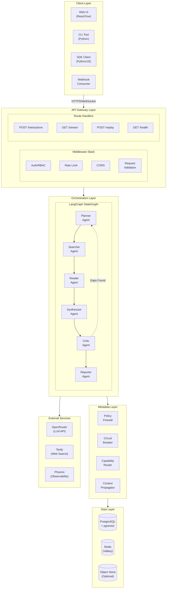

### Component Summary

| Layer | Components | Technology |
|-------|------------|------------|
| **Client** | Web UI, CLI, SDK, Webhooks | React, Python, REST/SSE |
| **API Gateway** | FastAPI, Middleware Stack | FastAPI 0.115+, Pydantic |
| **Orchestration** | LangGraph StateGraph, 6 Agents | LangGraph 1.0+, LangChain |
| **Metadata** | Policy, Circuit Breaker, Routing | Custom Python modules |
| **Data** | PostgreSQL, Redis, Object Store | PostgreSQL 16+, Redis 7+ |
| **External** | LLM, Search, Observability | OpenRouter, Tavily, Phoenix |

---

## Agentic Workflow

### Research DAG (Directed Acyclic Graph)

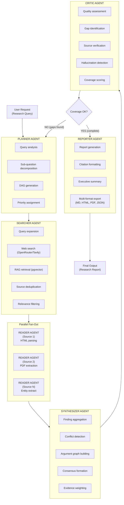

### State Machine Diagram

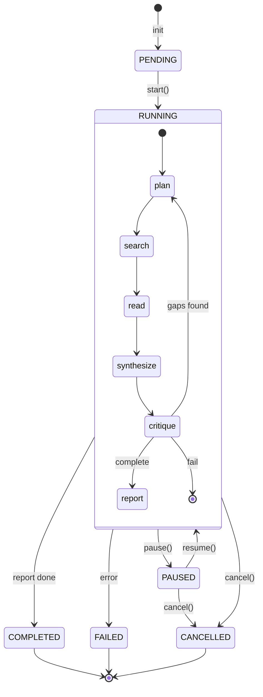

### Agent Communication Pattern

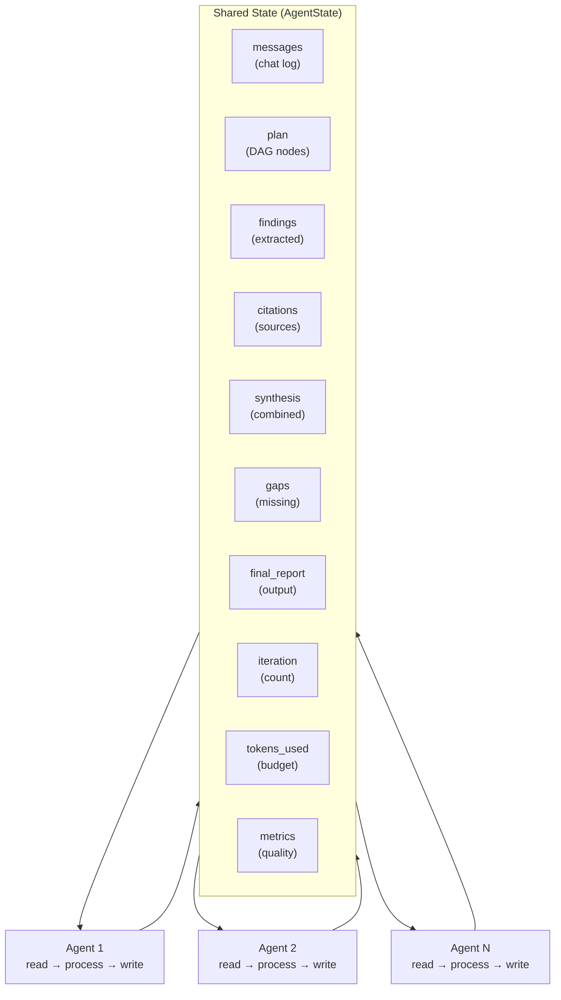

---

## Component Architecture

### API Gateway Components

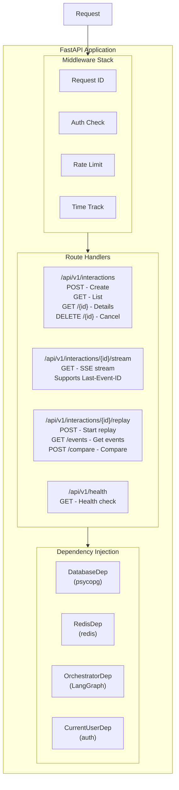

### Agent Architecture

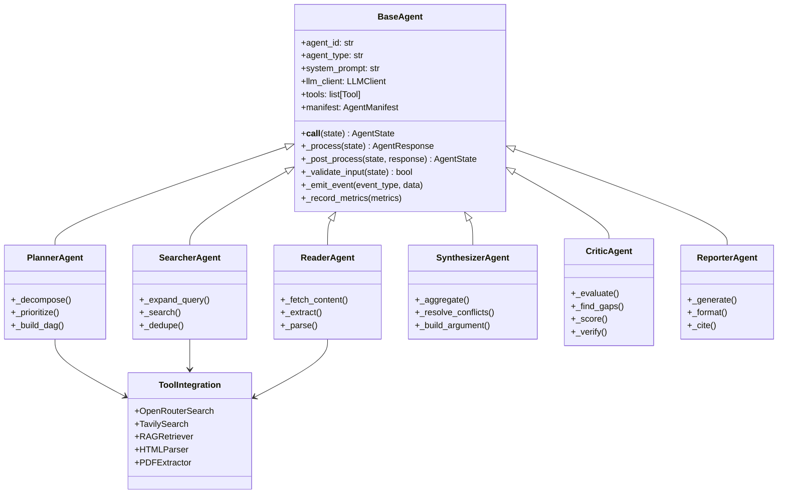

### Metadata Layer Architecture

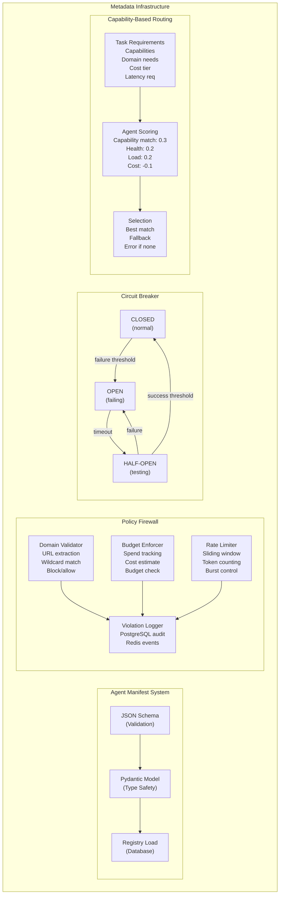

---

## Data Flow

### Request Lifecycle

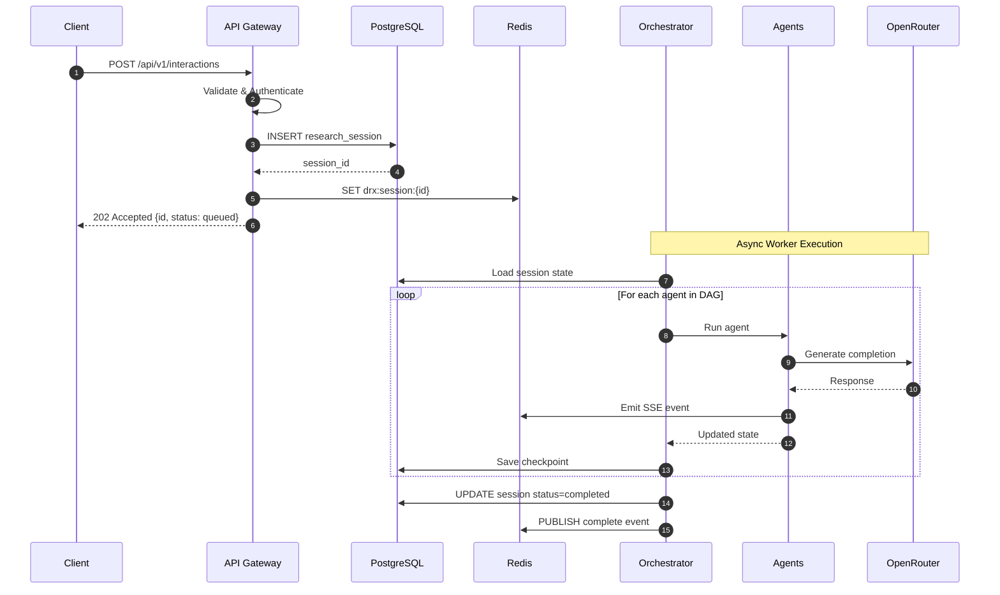

### SSE Streaming Flow

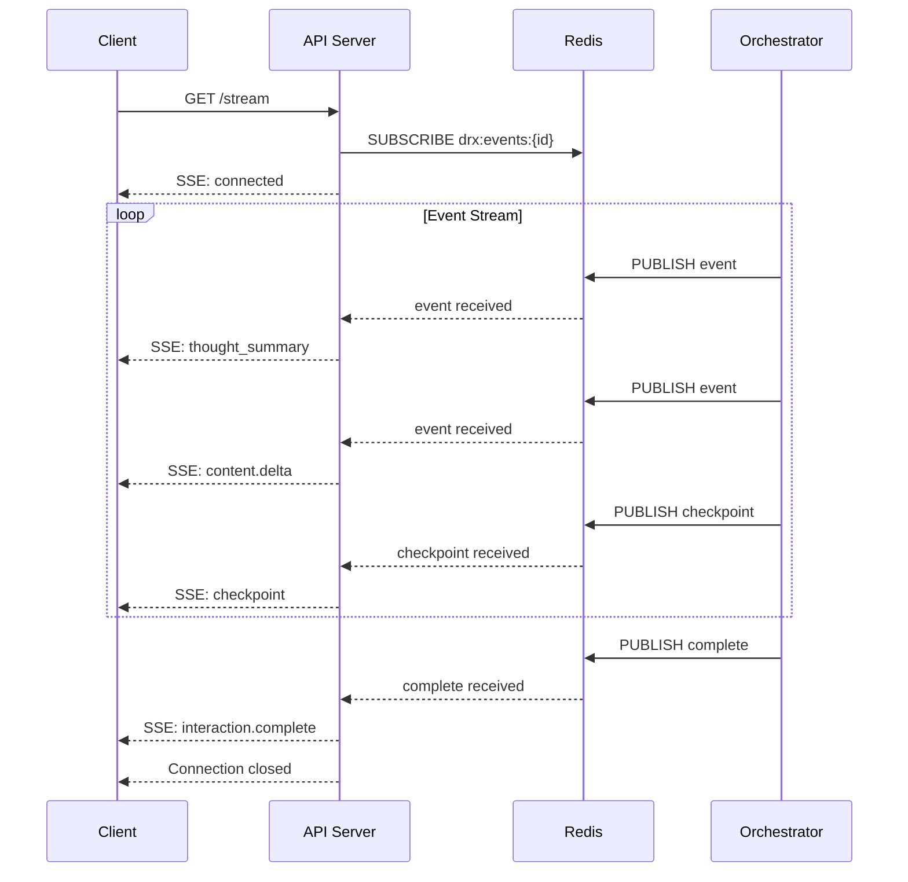

### Checkpoint & Resume Flow

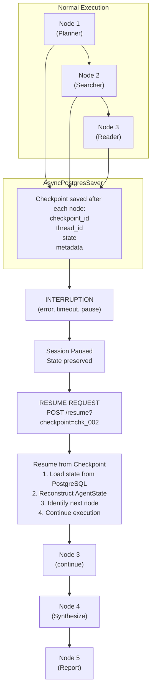

---

## API Gateway

### Authentication Flow

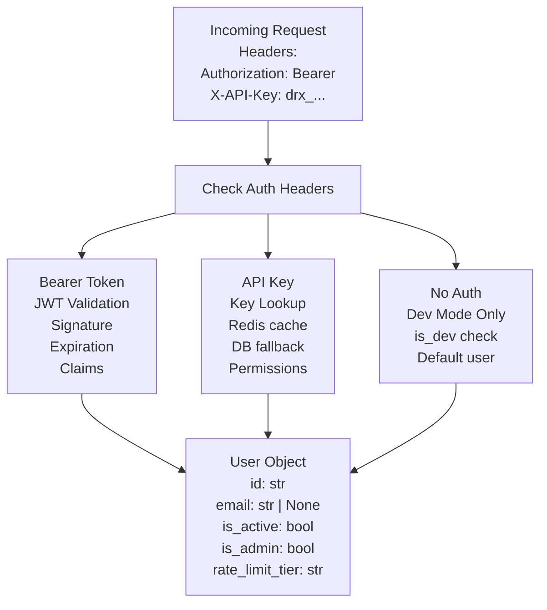

### Rate Limiting Architecture

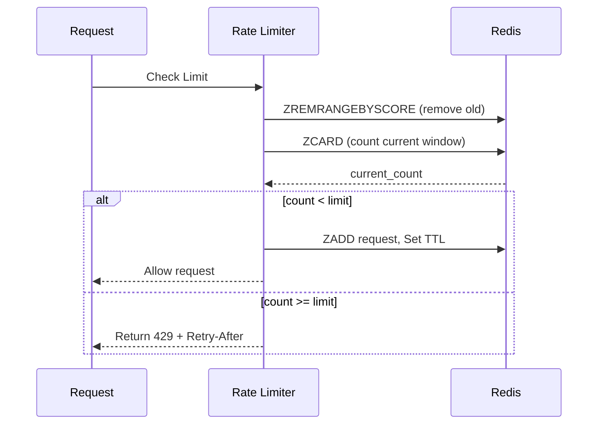

**Rate Limit Tiers:**

| Tier | Requests/min | Requests/hour | Burst Limit |
|------|--------------|---------------|-------------|
| standard | 60 | 1,000 | 10 |
| premium | 300 | 5,000 | 50 |
| unlimited | 10,000 | 100,000 | 1,000 |

---

## External Integrations

### OpenRouter LLM Integration

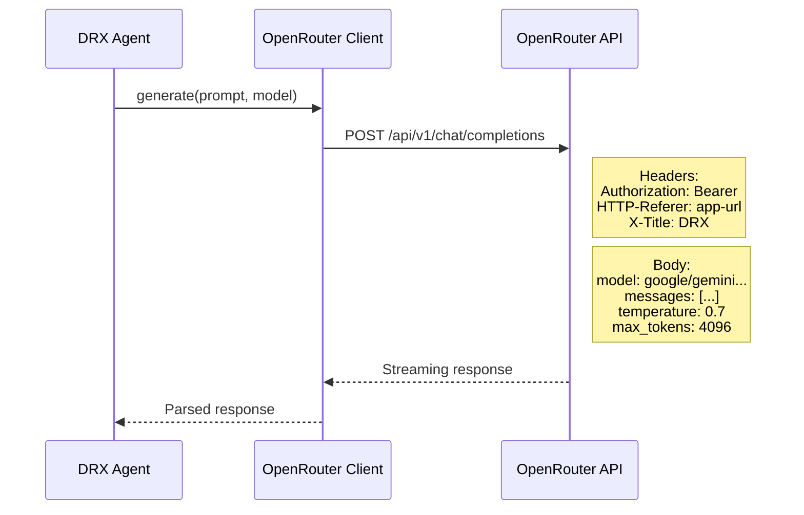

**Supported Models:**

| Model ID | Context | Use Case |
|----------|---------|----------|
| google/gemini-3-flash-preview | 1M | Default, fast |
| google/gemini-3-pro-preview | 1M | Complex reasoning |
| anthropic/claude-3.5-sonnet | 200K | High quality |
| deepseek/deepseek-r1 | 128K | Reasoning tasks |
| openai/gpt-4o | 128K | General purpose |
| openai/gpt-oss-20b:free | 131K | Free search model |

### Web Search Integration

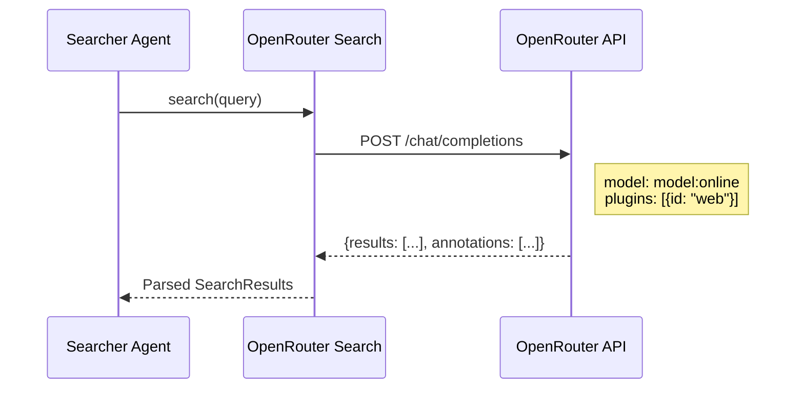

**SearchResult Schema:**
```json
{
  "url": "https://...",
  "title": "Article Title",
  "content": "Extracted content...",
  "score": 0.95,
  "metadata": {
    "source": "openrouter",
    "engine": "native"
  }
}
```

---

## Instrumentation & Observability

### Tracing Architecture

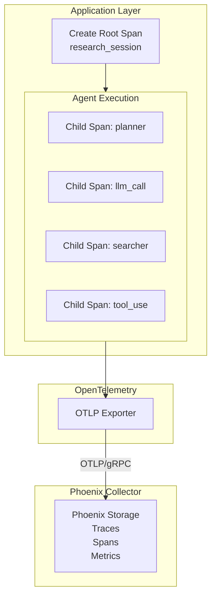

**Span Hierarchy:**

```mermaid
flowchart TB
    Root["research_session (root)"]

    Planner["planner_agent"]
    PlannerLLM["llm_call (gemini-flash)"]
    PlannerState["state_update"]

    Searcher["searcher_agent"]
    SearcherLLM["llm_call (query expansion)"]
    SearcherTool1["tool_call (web_search)"]
    SearcherTool2["tool_call (rag_retrieve)"]

    Reader0["reader_agent[0]"]
    Reader0Tool["tool_call (html_parse)"]
    Reader0LLM["llm_call (extraction)"]

    Reader1["reader_agent[1]"]

    Synthesizer["synthesizer_agent"]
    SynthesizerLLM["llm_call (synthesis)"]

    Critic["critic_agent"]
    CriticLLM["llm_call (evaluation)"]

    Reporter["reporter_agent"]
    ReporterLLM["llm_call (report generation)"]

    Root --> Planner
    Planner --> PlannerLLM
    Planner --> PlannerState

    Root --> Searcher
    Searcher --> SearcherLLM
    Searcher --> SearcherTool1
    Searcher --> SearcherTool2

    Root --> Reader0
    Reader0 --> Reader0Tool
    Reader0 --> Reader0LLM

    Root --> Reader1
    Root --> Synthesizer
    Synthesizer --> SynthesizerLLM

    Root --> Critic
    Critic --> CriticLLM

    Root --> Reporter
    Reporter --> ReporterLLM
```

### Metrics Collection

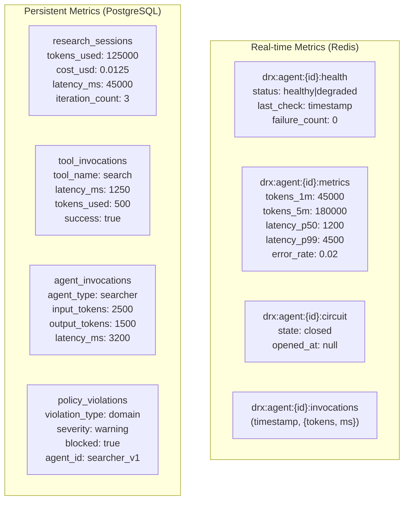

---

## Evaluation Pipeline

### Evaluation Workflow

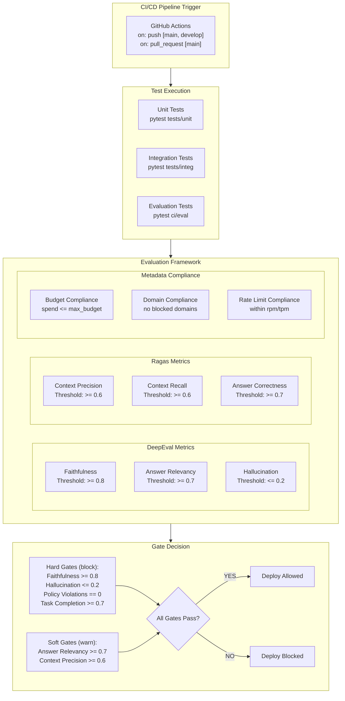

### Phoenix Dashboard

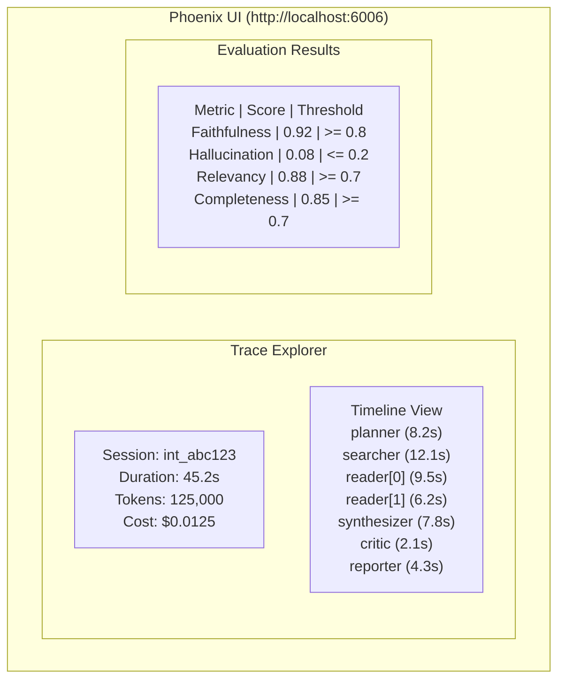

---

## Appendix

### Technology Stack Summary

| Category | Technology | Version | Purpose |
|----------|------------|---------|---------|
| **Language** | Python | 3.11+ | Core implementation |
| **Orchestration** | LangGraph | 1.0+ | Agent workflow DAG |
| **Framework** | FastAPI | 0.115+ | REST API |
| **Database** | PostgreSQL | 16+ | Persistent storage |
| **Vector DB** | pgvector | 0.8+ | Embedding storage |
| **Cache** | Redis | 7+ | State, rate limiting |
| **Queue** | Celery | 5.4+ | Async task execution |
| **LLM Gateway** | OpenRouter | - | Multi-model access |
| **Search** | OpenRouter Native | - | Web search (free) |
| **Observability** | Phoenix | 12+ | Tracing, eval |
| **Telemetry** | OpenTelemetry | 1.28+ | Distributed tracing |
| **Eval** | DeepEval | 1.0+ | LLM evaluation |
| **Eval** | Ragas | 0.1+ | RAG evaluation |
| **Guardrails** | NeMo | 0.19+ | Safety rails |

### Port Allocations

| Service | Port | Protocol |
|---------|------|----------|
| FastAPI | 8000 | HTTP |
| Phoenix | 6006 | HTTP |
| Phoenix Collector | 4317 | gRPC |
| PostgreSQL | 5432 | TCP |
| Redis | 6379 | TCP |
