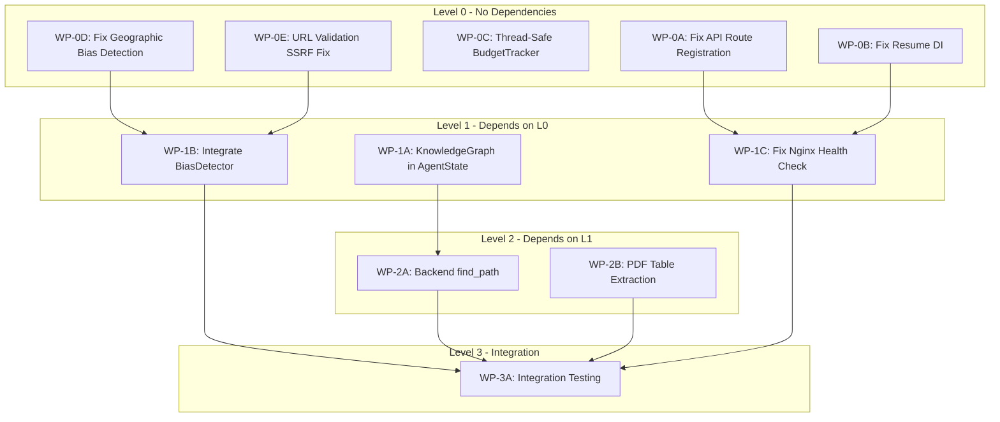

# DRX Bug Fix Implementation Plan

## Status: COMPLETED

All 10 work packets have been implemented and merged to main.

## Overview

This plan addressed 8 critical/medium bugs discovered during IC9-level testing.
Work packets were arranged in **topological order** with loose coupling.

## Dependency Graph



---

## Level 0 Work Packets (Parallel - No Dependencies)

### WP-0A: Fix API Route Registration
**Bug**: BUG-1 (HIGH) - `replay_routes.py` not registered in `main.py`
**Files**:
- `src/api/main.py` (edit)
- `src/api/replay_routes.py` (verify)
**Changes**:
1. Import replay_router from replay_routes
2. Register router with `app.include_router()`
**Branch**: `fix/wp-0a-replay-routes`

### WP-0B: Fix Resume Endpoint Dependency Injection
**Bug**: BUG-2 (HIGH) - `resume_interaction` uses `= None` instead of `Depends()`
**Files**:
- `src/api/routes.py` (edit lines 839-844)
**Changes**:
1. Change `background_tasks: BackgroundTasks = None` to use proper DI
2. Fix all dependency parameters to use `Depends()`
**Branch**: `fix/wp-0b-resume-di`

### WP-0C: Thread-Safe BudgetTracker
**Bug**: BUG-7 (MEDIUM) - BudgetTracker counters not thread-safe
**Files**:
- `src/orchestrator/budget.py` (edit)
**Changes**:
1. Add `asyncio.Lock()` for counter operations
2. Wrap `_tokens_used`, `_cost_used` updates with lock
**Branch**: `fix/wp-0c-budget-threadsafe`

### WP-0D: Fix Geographic Bias Detection
**Bug**: BUG-8 (MEDIUM) - `.com` incorrectly marked as US
**Files**:
- `src/tools/bias_detector.py` (edit lines 104-109)
**Changes**:
1. Remove `.com` from US-specific TLDs
2. Add proper geographic detection logic
3. Consider `.com` as "international" unless other signals
**Branch**: `fix/wp-0d-geo-bias`

### WP-0E: URL Validation for SSRF Prevention
**Bug**: BUG-5 (MEDIUM) - No URL validation before fetch
**Files**:
- `src/tools/pdf_extractor.py` (edit)
- `src/tools/citation_verifier.py` (edit)
- `src/utils/url_validator.py` (create)
**Changes**:
1. Create URL validator utility (block private IPs, localhost)
2. Add validation before `httpx` requests
3. Optional domain allowlist support
**Branch**: `fix/wp-0e-ssrf-validation`

---

## Level 1 Work Packets (After Level 0)

### WP-1A: Add KnowledgeGraph to AgentState
**Bug**: BUG-6 (MEDIUM) - KnowledgeGraph not checkpointed
**Dependencies**: None (but benefits from L0 completion)
**Files**:
- `src/orchestrator/state.py` (edit)
- `src/models/knowledge.py` (verify TypedDict compatibility)
- `src/orchestrator/nodes.py` (update to use state KG)
**Changes**:
1. Add `knowledge_graph` field to AgentState
2. Ensure KnowledgeGraph serializes properly for checkpointing
3. Update synthesizer node to populate KG in state
**Branch**: `fix/wp-1a-kg-state`

### WP-1B: Integrate BiasDetector into Workflow
**Bug**: BUG-3 (HIGH) - BiasDetector never called
**Dependencies**: WP-0D, WP-0E (bias and URL fixes)
**Files**:
- `src/orchestrator/nodes.py` (edit critique_synthesis)
- `src/agents/critic.py` (integrate BiasDetector)
- `src/orchestrator/state.py` (add bias_report field)
**Changes**:
1. Import BiasDetector in critic agent
2. Call bias analysis during critique phase
3. Add BiasReport to AgentState
4. Include bias metrics in quality assessment
**Branch**: `fix/wp-1b-bias-integration`

### WP-1C: Fix Nginx Health Check
**Dependencies**: WP-0A, WP-0B (API must be healthy first)
**Files**:
- `deployment/nginx/nginx.conf` (edit)
- `deployment/docker-compose.yml` (verify health check)
**Changes**:
1. Adjust nginx health check endpoint
2. Ensure proper upstream dependency on API
**Branch**: `fix/wp-1c-nginx-health`

---

## Level 2 Work Packets (After Level 1)

### WP-2A: Add Backend find_path() to KnowledgeGraph
**Dependencies**: WP-1A (KG in state)
**Files**:
- `src/models/knowledge.py` (add method)
- `src/api/routes.py` (add endpoint if needed)
**Changes**:
1. Implement A* or Dijkstra pathfinding
2. Weight by confidence (inverse)
3. Return path with intermediate entities
**Branch**: `feat/wp-2a-kg-pathfinding`

### WP-2B: Implement PDF Table Extraction
**Dependencies**: None (parallel with WP-2A)
**Files**:
- `src/tools/pdf_extractor.py` (major edit)
- `requirements.txt` (add pdfplumber)
**Changes**:
1. Add pdfplumber dependency
2. Implement table detection and extraction
3. Populate `Table` TypedDict properly
**Branch**: `feat/wp-2b-table-extraction`

---

## Level 3 Work Packets (Integration)

### WP-3A: Integration Testing
**Dependencies**: All Level 2 complete
**Files**:
- `tests/integration/` (create/update)
**Changes**:
1. End-to-end API test
2. Bias detection integration test
3. KnowledgeGraph checkpointing test
4. PDF table extraction test
**Branch**: `test/wp-3a-integration`

---

## Execution Order

```
Time →
├── T0: [WP-0A] [WP-0B] [WP-0C] [WP-0D] [WP-0E]  (parallel)
├── T1: [WP-1A] [WP-1B] [WP-1C]                   (parallel, after L0 merge)
├── T2: [WP-2A] [WP-2B]                           (parallel, after L1 merge)
└── T3: [WP-3A]                                   (after L2 merge)
```

## Git Strategy

1. Each WP creates feature branch from `main`
2. Atomic commits per logical change
3. Merge to `main` after each level completes
4. Final integration commit after WP-3A

---

## Execution Summary (Completed)

### Level 0 - All Parallel (5 agents)
| WP | Commit | Status |
|----|--------|--------|
| WP-0A | `9afcc92` | MERGED - Replay routes registered |
| WP-0B | `32ca66e` | MERGED - Resume DI fixed |
| WP-0C | `8bd7469` | MERGED - BudgetTracker thread-safe |
| WP-0D | `51b2568` | MERGED - Geographic bias fixed |
| WP-0E | `3ce737e` | MERGED - SSRF validation added |

### Level 1 - After L0 Merge (3 agents)
| WP | Commit | Status |
|----|--------|--------|
| WP-1A | `44744c3` | MERGED - KnowledgeGraph in state |
| WP-1B | `58a8f83` | MERGED - BiasDetector integrated |
| WP-1C | `3560db9` | MERGED - Nginx health fixed |

### Level 2 - After L1 Merge (2 agents)
| WP | Commit | Status |
|----|--------|--------|
| WP-2A | `6f641b0` | MERGED - find_path() added |
| WP-2B | `df05ac1` | MERGED - Table extraction implemented |

### Bugs Fixed
- BUG-1 (HIGH): Replay routes registered
- BUG-2 (HIGH): Resume endpoint DI fixed
- BUG-3 (HIGH): BiasDetector integrated
- BUG-5 (MEDIUM): SSRF prevention added
- BUG-6 (MEDIUM): KnowledgeGraph checkpointing
- BUG-7 (MEDIUM): Thread-safe BudgetTracker
- BUG-8 (MEDIUM): Geographic bias detection

### Features Added
- Backend find_path() for KnowledgeGraph
- PDF table extraction with pdfplumber
