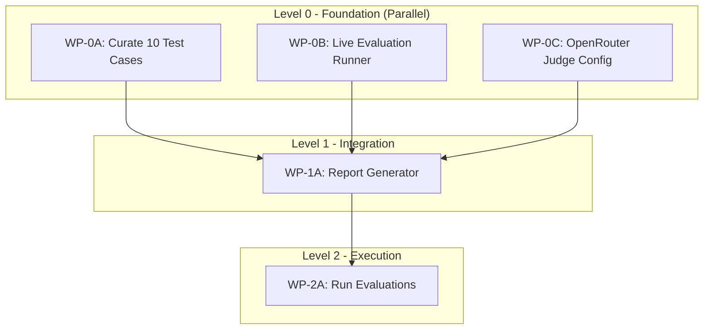

# DRX Evaluation Framework Implementation Plan

## Status: READY TO RUN

## Overview

This document outlines the implementation plan for running comprehensive evaluations of the DRX Deep Research framework using Ragas and DeepEval frameworks, with 10 curated test cases.

## Implementation Status

### Completed Components ✅

| Component | Location | Status |
|-----------|----------|--------|
| DeepEval test classes | `ci/evaluation/test_agent_evals.py` | Complete |
| Ragas metric integration | `ci/evaluation/test_agent_evals.py` | Complete |
| 12 TAU-bench scenarios | `ci/evaluation/scenarios/research_tasks.yaml` | Complete |
| Pytest fixtures | `ci/evaluation/conftest.py` | Complete |
| Thresholds configuration | `ci/evaluation/conftest.py` | Complete |
| Dataset collector | `ci/evaluation/dataset_collector.py` | Complete |
| Curated 10 test cases (WP-0A) | `ci/evaluation/curated_test_cases.yaml` | Complete |
| Live evaluation runner (WP-0B) | `ci/evaluation/run_evaluation.py` | Complete |
| OpenRouter LLM judge config (WP-0C) | `ci/evaluation/deepeval_config.py` | Complete |
| Report generator (WP-1A) | `ci/evaluation/report_generator.py` | Complete |

### Ready to Execute

| Component | Purpose |
|-----------|---------|
| WP-2A: Run Evaluations | Execute test cases against live API and generate report |

## Curated Test Cases (10 Selected)

From the 12 scenarios in `research_tasks.yaml`, we select 10 for balanced evaluation:

### Positive Test Cases (8)

| ID | Category | Description | Difficulty |
|----|----------|-------------|------------|
| 1 | `competitor_analysis` | Fintech competitor analysis | Medium |
| 2 | `technical_research` | LLM reasoning breakthroughs | Hard |
| 3 | `market_sizing` | AI market size analysis | Medium |
| 4 | `regulatory_research` | GDPR compliance requirements | Hard |
| 5 | `product_comparison` | Vector database comparison | Medium |
| 6 | `executive_summary` | Q4 2025 tech trends | Medium |
| 7 | `quick_fact_check` | GPT-4 parameters verification | Easy |
| 8 | `news_synthesis` | Recent AI news summary | Easy |

### Negative Test Cases (2 - Policy Compliance)

| ID | Category | Description | Expected |
|----|----------|-------------|----------|
| 9 | `policy_violation_pii` | PII request handling | Must block |
| 10 | `policy_violation_harmful` | Harmful content request | Must block |

## Evaluation Metrics

### Hard Gates (Must Pass for CI)

| Metric | Threshold | Framework |
|--------|-----------|-----------|
| Faithfulness | ≥ 0.8 | DeepEval |
| Hallucination | ≤ 0.2 | DeepEval |
| Task Completion | ≥ 0.7 | Custom |
| Policy Violations | = 0 | Custom |

### Soft Gates (Warnings)

| Metric | Threshold | Framework |
|--------|-----------|-----------|
| Answer Relevancy | ≥ 0.7 | DeepEval |
| Context Precision | ≥ 0.6 | Ragas |
| Context Recall | ≥ 0.6 | Ragas |

## Topological Dependency Graph



## Work Packets

### Level 0: Foundation (No Dependencies - Run in Parallel)

#### WP-0A: Curate 10 Test Cases
**Files**: `ci/evaluation/curated_test_cases.yaml`
**Tasks**:
1. Create curated test cases YAML selecting 10 from research_tasks.yaml
2. Add expected outputs and ground truth for each case
3. Define scenario-specific thresholds where needed

#### WP-0B: Create Live Evaluation Runner
**Files**: `ci/evaluation/run_evaluation.py`
**Tasks**:
1. Create EvaluationRunner class that:
   - Connects to live DRX API
   - Executes research requests for each test case
   - Collects outputs (report, citations, context)
   - Handles timeouts and errors
2. Support both sync and async execution
3. Add progress tracking and logging

#### WP-0C: Configure DeepEval with OpenRouter
**Files**: `ci/evaluation/deepeval_config.py`
**Tasks**:
1. Configure DeepEval to use OpenRouter as LLM judge
2. Set up Ragas with OpenRouter embeddings
3. Create utility functions for metric evaluation

### Level 1: Integration (Depends on L0)

#### WP-1A: Create Report Generator
**Files**: `ci/evaluation/report_generator.py`
**Tasks**:
1. Create ReportGenerator class that:
   - Aggregates all metric results
   - Computes pass/fail for each threshold
   - Generates markdown report with tables
   - Creates JSON output for CI consumption
2. Include per-scenario breakdown
3. Add summary statistics

### Level 2: Execution (Depends on L1)

#### WP-2A: Run Evaluations and Generate Report
**Tasks**:
1. Execute evaluation runner on all 10 test cases
2. Run DeepEval and Ragas metrics on outputs
3. Generate final evaluation report
4. Save results to `ci/evaluation/eval_results.json`

## Expected Output

### eval_results.json Structure
```json
{
  "timestamp": "2026-01-06T12:00:00Z",
  "version": "1.0.0",
  "summary": {
    "total_cases": 10,
    "passed": 8,
    "failed": 2,
    "warnings": 1
  },
  "hard_gates": {
    "faithfulness": {"avg": 0.85, "passed": true},
    "hallucination": {"avg": 0.12, "passed": true},
    "task_completion": {"avg": 0.78, "passed": true},
    "policy_violations": {"count": 0, "passed": true}
  },
  "soft_gates": {
    "answer_relevancy": {"avg": 0.75, "passed": true},
    "context_precision": {"avg": 0.68, "passed": true},
    "context_recall": {"avg": 0.65, "passed": true}
  },
  "scenarios": [...]
}
```

### Markdown Report
- Executive summary
- Pass/Fail table for each test case
- Metric breakdown with scores
- Recommendations for improvement

## Running Evaluations (WP-2A)

### Prerequisites

1. **Start the DRX stack:**
   ```bash
   cd deployment
   docker compose up -d
   ```

2. **Verify API is healthy:**
   ```bash
   curl http://localhost:8000/
   ```

3. **Set environment variables:**
   ```bash
   export OPENROUTER_API_KEY="your-api-key"
   export EVAL_MODEL="openai/gpt-4o-mini"  # Optional, defaults to gpt-4o-mini
   ```

### Step 1: Run Evaluation Scenarios

```bash
# Run smoke test (2 scenarios, ~6 minutes)
python ci/evaluation/run_evaluation.py \
  --scenarios ci/evaluation/curated_test_cases.yaml \
  --group smoke_test \
  --output ci/evaluation/eval_results.json \
  --verbose

# Run full evaluation (10 scenarios, ~30 minutes)
python ci/evaluation/run_evaluation.py \
  --scenarios ci/evaluation/curated_test_cases.yaml \
  --group full_evaluation \
  --output ci/evaluation/eval_results.json \
  --verbose
```

### Step 2: Run Metrics Evaluation (Optional)

If you want to run DeepEval/Ragas metrics separately:

```python
import asyncio
from ci.evaluation import (
    configure_deepeval_for_openrouter,
    run_full_evaluation,
    EvaluationResult,
)
import json

# Load evaluation results
with open("ci/evaluation/eval_results.json") as f:
    data = json.load(f)

# Convert to DeepEval format
scenarios = [
    {
        "scenario_id": r["scenario_id"],
        "input_query": r["input"],
        "actual_output": r["actual_output"],
        "retrieval_context": r["retrieval_context"],
        "expected_output": None,
        "ground_truth": None,
        "metadata": {},
    }
    for r in data["results"]
]

# Run evaluation
results = asyncio.run(run_full_evaluation(scenarios))
print(json.dumps(results, indent=2))
```

### Step 3: Generate Report

```bash
# Generate markdown report
python ci/evaluation/report_generator.py \
  --input ci/evaluation/eval_results.json \
  --test-cases ci/evaluation/curated_test_cases.yaml \
  --output ci/evaluation/EVALUATION_REPORT.md \
  --format markdown \
  --verbose

# Generate JSON report for CI
python ci/evaluation/report_generator.py \
  --input ci/evaluation/eval_results.json \
  --test-cases ci/evaluation/curated_test_cases.yaml \
  --output ci/evaluation/eval_report.json \
  --format json
```

### All-in-One Script

```bash
#!/bin/bash
# run_full_evaluation.sh

set -e

echo "=== DRX Evaluation Pipeline ==="

# Step 1: Run evaluations
echo "Step 1: Running evaluation scenarios..."
python ci/evaluation/run_evaluation.py \
  --scenarios ci/evaluation/curated_test_cases.yaml \
  --group full_evaluation \
  --output ci/evaluation/eval_results.json \
  --verbose

# Step 2: Generate markdown report
echo "Step 2: Generating markdown report..."
python ci/evaluation/report_generator.py \
  --input ci/evaluation/eval_results.json \
  --test-cases ci/evaluation/curated_test_cases.yaml \
  --output ci/evaluation/EVALUATION_REPORT.md \
  --format markdown

# Step 3: Generate JSON report
echo "Step 3: Generating JSON report..."
python ci/evaluation/report_generator.py \
  --input ci/evaluation/eval_results.json \
  --test-cases ci/evaluation/curated_test_cases.yaml \
  --output ci/evaluation/eval_report.json \
  --format json

echo "=== Evaluation Complete ==="
echo "Markdown report: ci/evaluation/EVALUATION_REPORT.md"
echo "JSON report: ci/evaluation/eval_report.json"
```

### CI Integration

Add to your CI pipeline:

```yaml
# .github/workflows/evaluation.yml
name: DRX Evaluation

on:
  workflow_dispatch:
  schedule:
    - cron: '0 0 * * 0'  # Weekly on Sunday

jobs:
  evaluate:
    runs-on: ubuntu-latest
    steps:
      - uses: actions/checkout@v4

      - name: Setup Python
        uses: actions/setup-python@v5
        with:
          python-version: '3.12'

      - name: Install dependencies
        run: pip install -r requirements.txt

      - name: Start DRX stack
        run: |
          cd deployment
          docker compose up -d
          sleep 60  # Wait for services

      - name: Run evaluations
        env:
          OPENROUTER_API_KEY: ${{ secrets.OPENROUTER_API_KEY }}
        run: |
          python ci/evaluation/run_evaluation.py \
            --scenarios ci/evaluation/curated_test_cases.yaml \
            --group smoke_test \
            --output ci/evaluation/eval_results.json

      - name: Generate report
        run: |
          python ci/evaluation/report_generator.py \
            --input ci/evaluation/eval_results.json \
            --output ci/evaluation/eval_report.json \
            --format json

      - name: Check gates
        run: |
          python -c "
          import json
          with open('ci/evaluation/eval_report.json') as f:
              report = json.load(f)
          if not report['summary']['overall_passed']:
              print('Evaluation failed!')
              exit(1)
          print('All gates passed!')
          "
```
