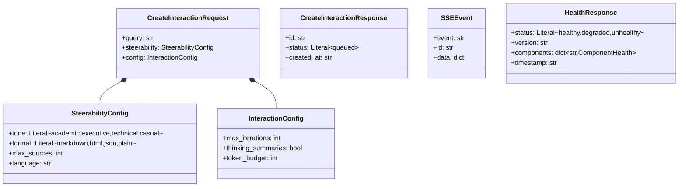

# DRX Low-Level Design (LLD) Document

## Table of Contents
1. [Class Diagrams](#class-diagrams)
2. [Database Design](#database-design)
3. [Sequence Diagrams](#sequence-diagrams)
4. [API Specifications](#api-specifications)
5. [Component Interfaces](#component-interfaces)
6. [Error Handling](#error-handling)
7. [Configuration Schema](#configuration-schema)

---

## Class Diagrams

### Agent Class Hierarchy


### State Classes


### Metadata Infrastructure Classes


### Service Classes


---

## Database Design

### Entity Relationship Diagram


### LangGraph Checkpoint Tables


### Table Indexes


---

## Sequence Diagrams

### Research Session Execution


### SSE Streaming Flow


### Circuit Breaker Flow


### Policy Firewall Check Flow


### Checkpoint Resume Flow


---

## API Specifications

### Endpoint Flow Diagram


### Request/Response Schema



### SSE Event Types


---

## Component Interfaces

### Interface Hierarchy


---

## Error Handling

### Error Hierarchy


### Error Codes Reference

| Category | Code | Description | Recoverable |
|----------|------|-------------|-------------|
| **Validation** | VAL_001 | Invalid input schema | No |
| | VAL_002 | Missing required field | No |
| | VAL_003 | Invalid field value | No |
| | VAL_004 | Invalid configuration | No |
| **Agent** | AGT_001 | Agent timeout | Yes |
| | AGT_002 | Circuit breaker open | Yes |
| | AGT_003 | Max iterations exceeded | No |
| | AGT_004 | Agent not found | No |
| | AGT_005 | Agent unavailable | Yes |
| **Policy** | POL_001 | Domain blocked | Yes |
| | POL_002 | Budget exceeded | Yes |
| | POL_003 | Rate limit exceeded | Yes |
| | POL_004 | Content policy violation | No |
| | POL_005 | Authentication required | No |
| **Service** | SVC_001 | LLM rate limited | Yes |
| | SVC_002 | LLM timeout | Yes |
| | SVC_003 | Search API error | Yes |
| | SVC_004 | External service unavailable | Yes |
| **Storage** | STR_001 | Database connection failed | Yes |
| | STR_002 | Redis connection failed | Yes |
| | STR_003 | Checkpoint not found | No |
| | STR_004 | Session not found | No |

### Error Response Format

```json
{
  "error": {
    "code": "POL_002",
    "message": "Budget exceeded for agent searcher_v1",
    "recoverable": true,
    "details": {
      "agent_id": "searcher_v1",
      "current_spend": 0.52,
      "max_budget": 0.50,
      "session_id": "550e8400..."
    }
  },
  "request_id": "req_abc123",
  "timestamp": "2024-12-15T10:35:00Z"
}
```

---

## Configuration Schema

### Environment Variable Groups


### Agent Manifest Schema


---

## Appendix: Redis Key Patterns


