# DRX Low-Level Design (LLD) Document

## Table of Contents

1. [Class Diagrams](#class-diagrams)
2. [Knowledge Graph Classes](#knowledge-graph-classes)
3. [Tool Classes](#tool-classes)
4. [Service Classes](#service-classes)
5. [Database Design](#database-design)
6. [Sequence Diagrams](#sequence-diagrams)
7. [API Specifications](#api-specifications)
8. [Error Handling](#error-handling)
9. [Configuration Schema](#configuration-schema)

---

## Class Diagrams

### Agent Class Hierarchy


### State Classes (TypedDict for LangGraph)


---

## Knowledge Graph Classes

### Entity-Relation-Claim Model


### Cytoscape Export Schema


---

## Tool Classes

### Base Tool Interface


### PDF Extractor


### Citation Verifier


### Bias Detector


---

## Service Classes

### Parallel Executor


### Budget Tracker


### Vector Store


### Report Exporter


### Progress Publisher


### Dataset Collector


### Feedback Store


---

## Database Design

### Entity Relationship Diagram


### LangGraph Checkpoint Tables


---

## Sequence Diagrams

### Parallel Research Execution

```mermaid
sequenceDiagram
    autonumber
    participant W as Worker
    participant O as Orchestrator
    participant PE as ParallelExecutor
    participant A1 as Searcher 1
    participant A2 as Searcher 2
    participant A3 as Searcher 3
    participant DB as PostgreSQL
    participant R as Redis

    W->>O: Start orchestration
    O->>PE: execute_plan_parallel(state)

    PE->>PE: resolve_dependencies()
    PE->>PE: get_ready_tasks() → [s1, s2, s3]

    par Fan-Out Search
        PE->>A1: execute(task_1)
        PE->>A2: execute(task_2)
        PE->>A3: execute(task_3)
    end

    A1-->>PE: SearchResults 1
    A2-->>PE: SearchResults 2
    A3-->>PE: SearchResults 3

    PE->>PE: fan_in(results)
    PE->>PE: deduplicate_sources()
    PE-->>O: merged_state

    O->>R: PUBLISH dag_state
    O->>DB: Save checkpoint
```



### Citation Verification Flow


### Feedback Collection Flow


### Knowledge Graph Building

```mermaid
sequenceDiagram
    participant Synth as Synthesizer
    participant KG as KnowledgeGraph
    participant Embed as EmbeddingProvider

    Synth->>KG: Initialize graph

    loop For each finding
        Synth->>Synth: Extract entities
        Synth->>Synth: Extract relations

        loop For each entity
            Synth->>Embed: embed(entity.name)
            Embed-->>Synth: embedding
            Synth->>KG: add_entity(entity)
        end

        loop For each relation
            Synth->>KG: add_relation(relation)
        end
    end

    Synth->>KG: Build claims from synthesis
    loop For each claim
        Synth->>KG: add_claim(claim)
    end

    Synth->>KG: export_cytoscape()
    KG-->>Synth: cytoscape_json
```

---

## API Specifications

### Request/Response Models

```mermaid
classDiagram
    class CreateInteractionRequest {
        +input: str
        +steerability: SteerabilityConfig | None
        +config: InteractionConfig | None
    }

    class InteractionConfig {
        +max_iterations: int
        +token_budget: int
        +timeout_seconds: int
        +enable_citations: bool
        +enable_quality_checks: bool
    }

    class InteractionResponse {
        +id: str
        +status: str
        +query: str
        +result: InteractionResult | None
        +created_at: str
        +completed_at: str | None
    }

    class InteractionResult {
        +final_report: str
        +findings: list~Finding~
        +citations: list~CitationRecord~
        +knowledge_graph: dict
        +tokens_used: int
        +cost_usd: float
        +iteration_count: int
        +quality_metrics: QualityMetrics
    }

    class FeedbackRequest {
        +rating: int
        +comment: str | None
        +labels: list~str~
    }

    class FeedbackResponse {
        +feedback_id: str
        +session_id: str
        +status: str
    }

    CreateInteractionRequest --> InteractionConfig
    InteractionResponse --> InteractionResult
```

### SSE Event Schema

```mermaid
classDiagram
    class SSEEvent {
        +event: str
        +id: str
        +data: str
    }

    class InteractionStartEvent {
        +interaction_id: str
        +status: str
        +query: str
    }

    class ThoughtSummaryEvent {
        +agent: str
        +thought: str
        +timestamp: str
    }

    class DAGStateEvent {
        +nodes: list~DAGNode~
        +edges: list~DAGEdge~
        +current_node: str | None
    }

    class ContentDeltaEvent {
        +content: str
        +agent: str
    }

    class CompleteEvent {
        +interaction_id: str
        +status: str
        +result: InteractionResult
    }

    SSEEvent <|-- InteractionStartEvent
    SSEEvent <|-- ThoughtSummaryEvent
    SSEEvent <|-- DAGStateEvent
    SSEEvent <|-- ContentDeltaEvent
    SSEEvent <|-- CompleteEvent
```

---

## Error Handling

### Error Hierarchy

```mermaid
classDiagram
    class DRXError {
        <<base>>
        +message: str
        +code: str
        +recoverable: bool
        +details: dict
    }

    class ValidationError {
        +code: VAL_*
    }

    class AgentError {
        +code: AGT_*
    }

    class PolicyError {
        +code: POL_*
    }

    class ServiceError {
        +code: SVC_*
    }

    class BudgetExceededError {
        +budget_type: str
        +used: float
        +limit: float
    }

    class CircuitOpenError {
        +agent_id: str
        +opened_at: str
    }

    class CitationVerificationError {
        +citation_id: str
        +issues: list~str~
    }

    DRXError <|-- ValidationError
    DRXError <|-- AgentError
    DRXError <|-- PolicyError
    DRXError <|-- ServiceError
    PolicyError <|-- BudgetExceededError
    AgentError <|-- CircuitOpenError
    ServiceError <|-- CitationVerificationError
```

### Error Codes

| Category | Code | Description | Recoverable |
|----------|------|-------------|-------------|
| **Validation** | VAL_001 | Invalid input schema | No |
| | VAL_002 | Missing required field | No |
| | VAL_003 | Invalid rating value | No |
| **Agent** | AGT_001 | Agent timeout | Yes |
| | AGT_002 | Circuit breaker open | Yes |
| | AGT_003 | Max iterations exceeded | No |
| | AGT_004 | Parallel execution failed | Yes |
| **Policy** | POL_001 | Domain blocked | Yes |
| | POL_002 | Token budget exceeded | Yes |
| | POL_003 | Cost budget exceeded | Yes |
| | POL_004 | Rate limit exceeded | Yes |
| **Service** | SVC_001 | LLM rate limited | Yes |
| | SVC_002 | Citation verification failed | Yes |
| | SVC_003 | PDF extraction failed | Yes |
| | SVC_004 | Embedding generation failed | Yes |

---

## Configuration Schema

### Environment Variables

```mermaid
flowchart TB
    subgraph Core["Core"]
        APP_ENV["APP_ENV"]
        DEBUG["DEBUG"]
        LOG_LEVEL["LOG_LEVEL"]
    end

    subgraph Database["Database"]
        DATABASE_URL["DATABASE_URL"]
        DB_POOL_SIZE["DB_POOL_SIZE"]
    end

    subgraph Redis["Redis"]
        REDIS_URL["REDIS_URL"]
        CELERY_BROKER_URL["CELERY_BROKER_URL"]
    end

    subgraph LLM["LLM"]
        OPENROUTER_API_KEY["OPENROUTER_API_KEY"]
        DEFAULT_MODEL["DEFAULT_MODEL"]
        REASONING_MODEL["REASONING_MODEL"]
        SEARCH_MODEL["SEARCH_MODEL"]
    end

    subgraph Budget["Budget"]
        TOKEN_BUDGET_PER_SESSION["TOKEN_BUDGET_PER_SESSION"]
        COST_BUDGET_PER_SESSION["COST_BUDGET_PER_SESSION"]
    end

    subgraph Research["Research"]
        MAX_RESEARCH_ITERATIONS["MAX_RESEARCH_ITERATIONS"]
        MAX_SOURCES_PER_QUERY["MAX_SOURCES_PER_QUERY"]
        MIN_COVERAGE_SCORE["MIN_COVERAGE_SCORE"]
    end

    subgraph Observability["Observability"]
        PHOENIX_ENABLED["PHOENIX_ENABLED"]
        PHOENIX_COLLECTOR_ENDPOINT["PHOENIX_COLLECTOR_ENDPOINT"]
        PROMETHEUS_ENABLED["PROMETHEUS_ENABLED"]
    end
```

### Model Cost Configuration

```python
MODEL_COSTS = {
    "google/gemini-3-flash-preview": {"input": 0.075, "output": 0.30},
    "google/gemini-3-flash-preview:online": {"input": 0.075, "output": 0.30},
    "deepseek/deepseek-r1": {"input": 0.55, "output": 2.19},
    "anthropic/claude-3.5-sonnet": {"input": 3.0, "output": 15.0},
    "openai/gpt-4o": {"input": 2.5, "output": 10.0},
    "openai/gpt-4o-mini": {"input": 0.15, "output": 0.60},
}
```

---

## Redis Key Patterns

```mermaid
flowchart TB
    subgraph Session["Session State"]
        SessionHash["drx:session:{id}<br/>HASH: status, node, iteration"]
    end

    subgraph Events["Event Streaming"]
        EventStream["drx:events:{id}<br/>STREAM: event_type, data"]
        CancelKey["drx:cancel:{id}<br/>STRING: '1' if cancelled"]
    end

    subgraph Feedback["Feedback Cache"]
        FeedbackHash["drx:feedback:{session_id}<br/>HASH: rating, labels"]
        AggregateHash["drx:feedback:aggregate<br/>HASH: total, avg_rating"]
    end

    subgraph Metrics["Real-time Metrics"]
        AgentMetrics["drx:agent:{id}:metrics<br/>HASH: tokens, latency"]
        CircuitState["drx:agent:{id}:circuit<br/>HASH: state, failures"]
    end
```
